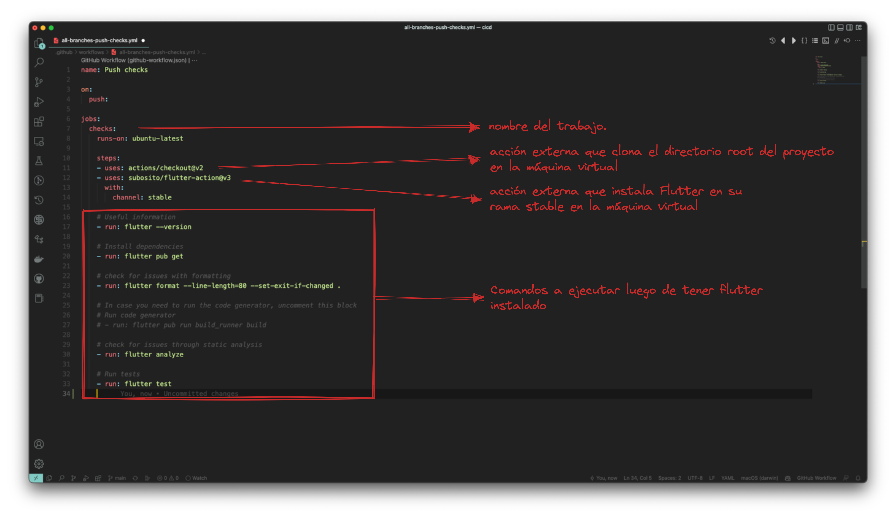

# Primera acción con Flutter

Nuestra intensión con el curso, más allá de aprender, es que le quede código al estudiante que pueda reutilizar en sus proyectos, es por esto que nuestra __primera acción__ específica para Flutter será correr un par de __checkeos__ de código cada vez que se realize un ```push``` en el código.

## Creando el projecto ejemplo

Utilizaremos el tipico ejemplo que viene con Flutter, para ello nos ubicamos en el root del proyecto de cicd que venimos utilizando y ejecutamos

```bash
flutter create ./
```

Luego correremos el test para verificar si está todo ok.

```bash
flutter analyze
flutter test
```

## Agregando los checks con la acción push

Agregaremos un nuevo archivo en la carpeta de Workflows al cual llamaremos ```all-branches-push-checks.yml``` y copiaremos el código del [snipet](all-branches-push-checks.yml), el cual analizaremos a continuación.



Los comandos ejectuados en el Workflow son los que nuestro equipo considera indispensables en el momento de subir código a nuestro repositorio. El comando ```flutter pub run build_runner build``` que se encuentra comentado muchas veces no es necesario, ya que muchos desarrolladores toman por convensión incluir los archivos generados ```*.g.dart``` en el repositorio, por lo cual no sería necesario ejecutarlo en el ```push```.
