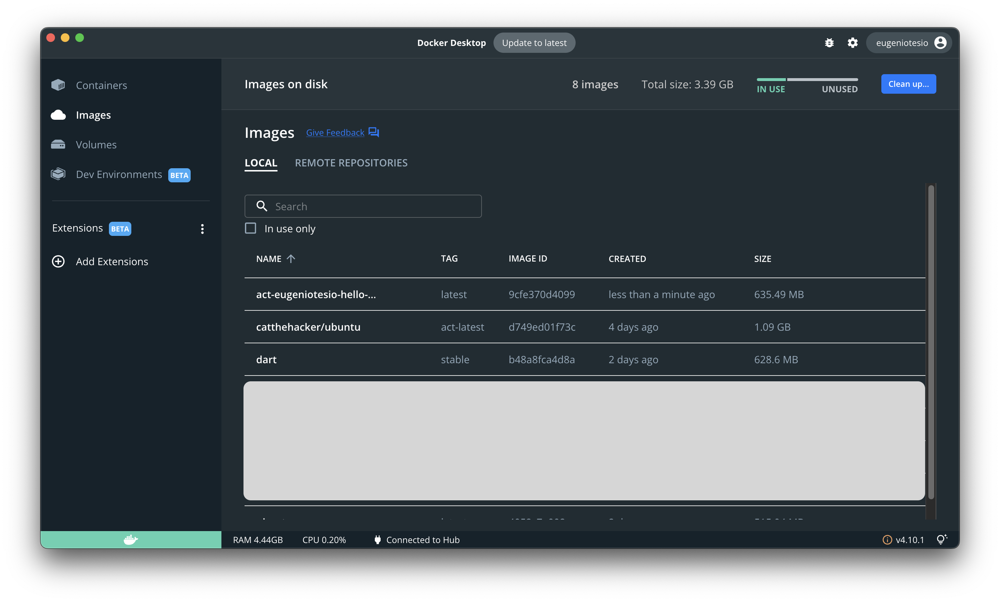

# Ejecutando acciones en localhost

El primer poblema con el que tropezaremos a la hora de empezar a escribir nuestra propia GitHub Action es que resulta muy tedioso hacer push, pull requests, etc para probar que nuestra acción funciona correctamente, sin mencionar lo mal y desprolijo que queda nuestro repositorio; algo que, siendo profesionales, debes cuidar.


## Instalando y probando la herramienta

La herramienta para realizar las pruebas en forma local es [act](https://github.com/nektos/act/). Para instalar la herramienta es necesario tener [Docker Desktop](https://docs.docker.com/desktop/) instalado. Para instalarlo solo es necesario ejecutar:

- MacOS (es necesario tener [Homebrew](https://brew.sh/) instalado)

    ```bash
    brew install act
    ```

- Windows (es necesario tener [Chocolatey](https://docs.chocolatey.org/en-us/choco/setup) instalado)

    ```bash
    choco install act-cli
    ```

Una vez instalada, probaremos si funciona correctamente. Ejecutando el siguiente comando en el root de nuestro proyecto para listar los Workflow disponibles:

```bash
act -l
```

El cual en nuestro proyecto de cicd debería arrojar la siguiente salida:

```
Stage  Job ID                Job name              Workflow name     Workflow file                 Events
0      run-external-action   run-external-action   External Actions  acciones_externas.yml         push  
0      checks                checks                Push checks       all-branches-push-checks.yml  push  
0      run-shell-command     run-shell-command     Shell Commands    hola_mundo.yml                push  
1      run-windows-commands  run-windows-commands  Shell Commands    hola_mundo.yml                push
```

Esto prueba que la herramienta está funcionando correctamiente.

## Corriendo el programa

Ejecutando la siguiente línea de comando ejecutaremos la acción `run-external-action`:

```bash
act -j run-external-action
```

Para el caso del chipset M1 o superior de Apple, hay que agregarle `--container-architecture linux/arm64`:

```bash
act -j run-external-action --container-architecture linux/arm64
```

La salida de la consola será:

```bash
[External Actions/run-external-action] 🚀  Start image=catthehacker/ubuntu:act-latest
[External Actions/run-external-action]   🐳  docker pull image=catthehacker/ubuntu:act-latest platform=linux/arm64 username= forcePull=false
[External Actions/run-external-action]   🐳  docker create image=catthehacker/ubuntu:act-latest platform=linux/arm64 entrypoint=["tail" "-f" "/dev/null"] cmd=[]
[External Actions/run-external-action]   🐳  docker run image=catthehacker/ubuntu:act-latest platform=linux/arm64 entrypoint=["tail" "-f" "/dev/null"] cmd=[]
[External Actions/run-external-action]   ☁  git clone 'https://github.com/EugenioTesio/hello-world-dart-action' # ref=v1.0
[External Actions/run-external-action] ⭐ Run Main Hello world Dart
[External Actions/run-external-action]   🐳  docker pull image=act-eugeniotesio-hello-world-dart-action-v1-0-dockeraction:latest platform=linux/arm64 username= forcePull=false
[External Actions/run-external-action]   🐳  docker create image=act-eugeniotesio-hello-world-dart-action-v1-0-dockeraction:latest platform=linux/arm64 entrypoint=[] cmd=["Mauro"]
[External Actions/run-external-action]   🐳  docker run image=act-eugeniotesio-hello-world-dart-action-v1-0-dockeraction:latest platform=linux/arm64 entrypoint=[] cmd=["Mauro"]
| Hello Mauro
| 
[External Actions/run-external-action]   ⚙  ::set-output:: time=2023-01-26 11:37:27.509529
[External Actions/run-external-action]   ✅  Success - Main Hello world Dart
[External Actions/run-external-action] ⭐ Run Main Log output
[External Actions/run-external-action]   🐳  docker exec cmd=[bash --noprofile --norc -e -o pipefail /var/run/act/workflow/1] user= workdir=
| 2023-01-26 11:37:27.509529
[External Actions/run-external-action]   ✅  Success - Main Log output
[External Actions/run-external-action] 🏁  Job succeeded
```

Se puede ver como act crea 2 imagenes:

- catthehacker/ubuntu.
- act-eugeniotesio-hello-world-dart-action-v1-0-dockeraction.

La primera es la herramienta __act__ en sí y la segunda es la imagen de nuestro proyecto. Si abren Docker Desktop, en la pestaña Images, verán 3 imágenes creadas, las 2 anteriores y una más de __Dart__ que es creada por la acción `EugenioTesio/hello-world-dart-action@v1`.


