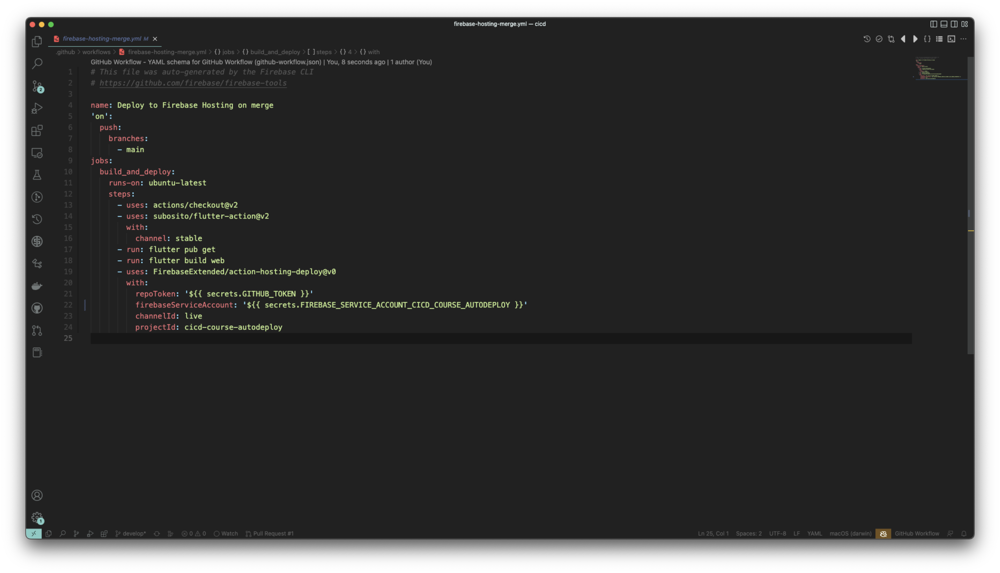
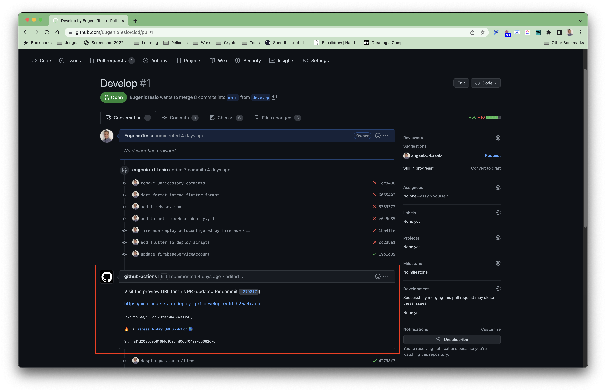

# Bonus track

En esta sección queremos dejarles una muy importante acción que los ayudará en sus proyectos actuales. Se trata de construir una previsualización del proyecto para cada acción de `pull request`. Esta es una muy buena práctica ya que tendremos la evidencia de como funciona la aplicación con los cambios introducidos.

El deploy de la web se utilizará la acción [FirebaseExtended/action-hosting-deploy](https://github.com/FirebaseExtended/action-hosting-deploy) que use Firebase Hosting para hostear nuestra página web sin costo. Entonces comenzaremos creando un proyecto nuevo en la plataforma.

## Creación del proyecto de Firebase

1. Ir a [https://console.firebase.google.com](https://console.firebase.google.com/).
2. En caso de no tener un usurio, registrarse.
3. Hacer click en `Crear un proyecto`. En caso de que ya tengan algún proyecto, hagan click en `Agregar Proyecto`.
4. Colocamos el nombre del proyecto, en mi caso utilizaré __cicd-course-autodeploy__, pero como el nombre debe ser único, cuando ustedes coloque este nombre abajo les sugerirá una variante terminada con números y caracteres aleatorios, ej: __cicd-course-autodeploy-6hgt6__.
5. Tildar los checkbox de Terminos y Condiciones, etc.
6. Hacer click en continuar para pasar al paso 2/3.
7. Deshabilitar las opciones de Firebase Analytics. Si es necesario las activaremos más adelante y continuar.

En este punto ya tendremos creado nuestro proyecto para el autodeploy de nuestros `pull request`.

## Generación del autodeploy

Con la herramienta de [Firebase CLI](https://firebase.google.com/docs/cli) podremos lograr nuestro objetivo de deplegar nuestro sitio web de previsualización en la acción de `pull request` y en la acción de `merge` con la rama principal.

### Instalación y cofiguración de Firebase CLI

Para instalar la herramienta según la plataforma seguir los pasos

#### Windows

1. Descargar el instalador de [aquí](https://firebase.tools/bin/win/instant/latest).
2. Abrir el archivo y seguir los pasos de instalación.

#### MacOS / Linux

1. Descargar el binario para [MacOS](https://firebase.tools/bin/macos/latest) o [Linux](https://firebase.tools/bin/linux/latest).
2. Crear una carpeta en el home `.firebase_tools` y copiar el archivo allí renombrandolo `firebase`.

    ```cmd
    mkdir $HOME/.firebase_tools
    cp firebase-tools-macos $HOME/.firebase_tools/firebase
    ```

3. Editar el archivo `~/.bash_profile, ~/.bashrc or profile` o `.~/.zshrc or .zprofile`, dependiendo si tenemos _Bash Shell_ o _Z Shell_ y agregar la ruta al `PATH` para poder ejecutar el binario desde cualquier lugar. Si al abrir el archivo la variable `PATH` está definida así:

    ```cmd
    PATH="$PATH"
    ```

    debemos reemplazarla por:

    ```cmd
    PATH="$PATH:$HOME/.firebase_tools"
    ```

4. Actualizamos las variables del sistema ejecutando:

    ```cmd
    source ~/.bashrc
    source ~/.zshrc
    ```

5. Comprobamos que se haya actualizado:

    ```cmd
    echo $PATH
    ```

    deberíamos ver que el `PATH` incluye a `$HOME/.firebase_tools`

Al finalizar al instalación de la herramienta ejecutaremos el siguiente paso, el cual nos abrirá una pestaña en nuestro navegador por defecto para que no autentifiquemos con nuestra cuenta de Google (la misma con la que crearon el proyecto de Firebase):

```cmd
firebase login
```

Para verificar que esté todo bien, podemos ejecutar

```cmd
firebase projects:list
```

el cual nos mostrará la lista de proyectos, en la cual debe estar `cicd-course-autodeploy`:

```cmd
✔ Preparing the list of your Firebase projects
┌────────────────────────┬────────────────────────┬────────────────┬──────────────────────┐
│ Project Display Name   │ Project ID             │ Project Number │ Resource Location ID │
├────────────────────────┼────────────────────────┼────────────────┼──────────────────────┤
│ cicd-course-autodeploy │ cicd-course-autodeploy │ 198022861637   │ [Not specified]      │
└────────────────────────┴────────────────────────┴────────────────┴──────────────────────┘

1 project(s) total.
```

## Generación de los scripts de autodeploy

Comenzaremos iniciando Firebase Hosting desde el CLI, el cual nos irá haciendo preguntas para generar la configuración del proyecto.

```cmd
firebase init hosting
```

Las preguntas y que responder se enumeran a continuación:


- `What do you want to use as your public directory? (public) build/web` que es la carpeta en donde se generará nuestro codigo html al ejecutar `flutter build web`.
- `Configure as a single-page app (rewrite all urls to /index.html)? (y/N) y`
- `Set up automatic builds and deploys with GitHub? (y/N) y`
- `File build/web/index.html already exists. Overwrite? (y/N) N`


Luego les va a abrir una pestaña en el navegador web para que se logueen en GitHub, de esta forma la herramienta podrá acceder en representación nuestra a los repositorios.

- `For which GitHub repository would you like to set up a GitHub workflow? (format: user/repository) EugenioTesio/cicd`. Es el path relativo de la URL del repo, que en mi caso es [https://github.com/EugenioTesio/cicd](https://github.com/EugenioTesio/cicd).
- `Set up the workflow to run a build script before every deploy? (y/N) y`
- `What script should be run before every deploy? (npm ci && npm run build)` le damos enter aquí, ya que luego modificaremos manualmente el archivo para incluir las acciones externas que permiten hacer el build de nuestro código.
- `Set up automatic deployment to your site's live channel when a PR is merged? (Y/n) y`
- `What is the name of the GitHub branch associated with your site's live channel? (main)` en mi caso la rama principal es main, por lo tanto le doy enter.

 Finalizado todo, la herramienta habrá realizado lo siguiente:

- Agregado del archivo `firebase.json` en el root del proyecto que continene las instrucciones para desplegar el proyecto.
- Creado del workflow `firebase-hosting-merge.yml` que se ejecutará solo cuando hagamos un push a la rama main.
- Creado del workflow `firebase-hosting-pull-request.yml` en el mismo directorio el cual se ejecutará para todo los push que hagamos.
- Generado la cuenta de servicio en Google Cloud Platform y asignado los permisos necesarios. Para ver la misma puedes acceder a [GCP Service Accounts page](https://console.cloud.google.com/iam-admin/serviceaccounts)
- Agregado el secreto  `FIREBASE_SERVICE_ACCOUNT_CICD_COURSE_AUTODEPLOY` en GitHub.

Es importante entender que Firebase fue integrado completamente a GCP, aunque se mantuvo su interfaz usuario, por lo que el tema de cuentas de servicio y permisos se maneja desde GCP. Para la creación de la cuenta de servicio seguiremos los siguientes pasos.

## Adaptar el workflow para Flutter

Observando ambos workflows generados vemos que el paso de construcción creado por la herramienta es `- run: npm ci && npm run build` que es incorrecto y deberemos reemplazarlo por el siguiente código tanto en el archivo `firebase-hosting-merge.yml` como en `firebase-hosting-pull-request.yml`:

```cmd
- uses: subosito/flutter-action@v2
    with:
      channel: stable
- run: flutter pub get
- run: flutter build web
```



Una vez realizado los cambios, subiremos los mismos a una nueva rama:

```cmd
git checkout develop
git add .
git commit -m"despliegue automático"
git push origin develop
```

Por último, iremos a al repositorio de GitHub y crearemos un pull request de la rama `develop` a la rama `main`. Una vez creado el PR podremos ver en la pestaña Action de GitHub como se está ejecutando nuestro workflow. Al finalizar el mismo, podremos ver dentro del PR creado que se agrego la url de la vista previa de nuestro proyecto.



Considermos muy importante poder contar con la vista previa de nuestro trabajo, facilita muchas detecciones de errores o incluso ajustes de UI antes del merge con la rama principal; por supuesto que está también la ventaja del ahorro de tiempo del equipo de trabajo.
