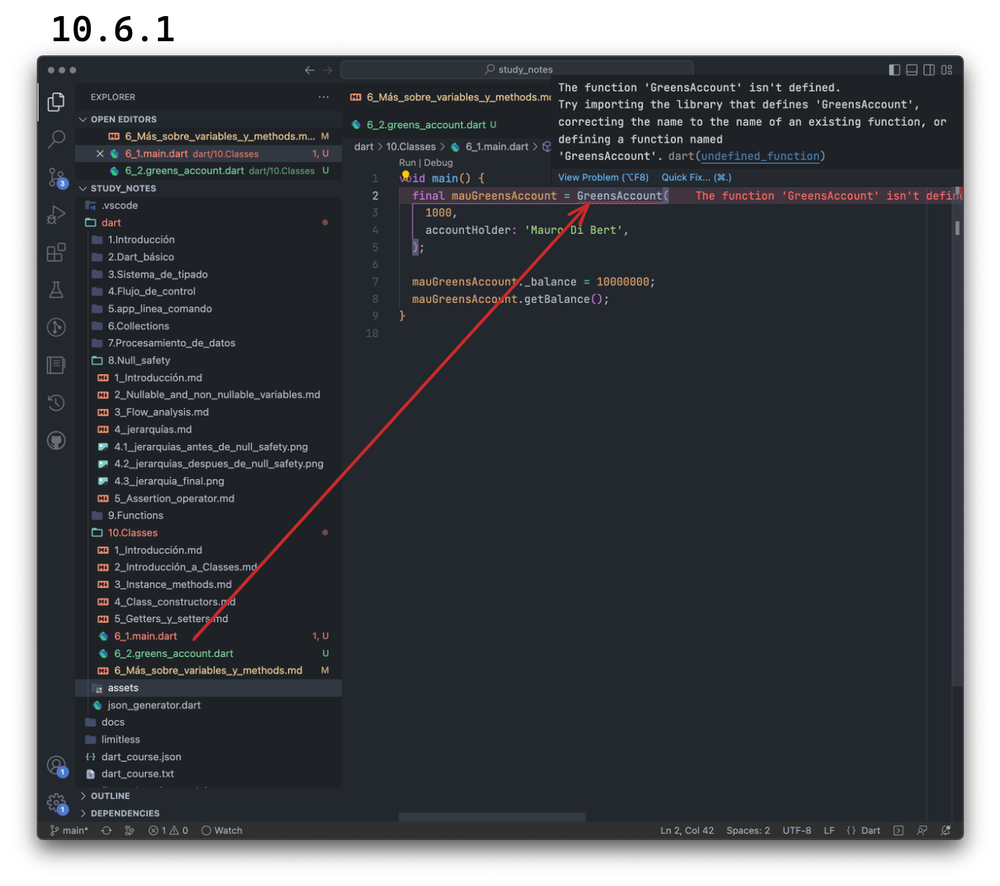

# Más sobre _variables_ y _methods_

Hasta ahora, cuando queríamos acceder a una variable de una clase, teníamos que hacer una instancia de ella y acceder dentro de dicha instancia de la siguiente manera:

```dart
class Car {
  Car({required this.speed});
  double speed;
}

void main() {
  final myCar = Car(speed: 220);
  print(myCar.speed);
}
```

Pero saben existen otro tipo de variables donde no es necesario instanciar la clase...

## _Static variables_

Son variables que pertenecen a la clase en sí y no a sus instancias. Nosotros solemos utilizarlas para crear valores constantes en un proyecto y así organizarlo. Por ejemplo:

```dart
class AppAssets {
  // * Logos
  static String facebookLogo = 'assets/images/logos/facebook_logo_minimal.svg';
  static String instagramLogo = 'assets/images/logos/instagram_logo_minimal.svg';
  static String linkedinLogo = 'assets/images/logos/linkedin_logo_minimal.svg';
  static String twitterLogo = 'assets/images/logos/twitter_logo_minimal.svg';
  static String monkslabNoBackground =
      'assets/images/logos/monkslab_logo_no_background.png';
}
```

Luego, cuando necesitamos utilizarlos por ejemplo en este caso para insertar un logo en nuestro proyecto, simplemente llamamos a la clase sin instanciarla y a su variable:

```dart
class AppAssets {
  // * Logos
  static String facebookLogo = 'assets/images/logos/facebook_logo_minimal.svg';
  static String instagramLogo = 'assets/images/logos/instagram_logo_minimal.svg';
  static String linkedinLogo = 'assets/images/logos/linkedin_logo_minimal.svg';
  static String twitterLogo = 'assets/images/logos/twitter_logo_minimal.svg';
  static String monkslabNoBackground =
      'assets/images/logos/monkslab_logo_no_background.png';
}

void main() {
  print(AppAssets.facebookLogo);
}
```

En este caso, recordemos que si estamos declarando una variable que no va a cambiar a lo largo de todo el proyecto y es definida en el momento de compilación podríamos declararla como `const` y al mismo tiempo, utilizar el _type inference_ de Dart y sacarle el `String`. En ese caso, estaríamos definiendo una variable global que pertenece a una clase:

```dart
class AppAssets {
  // * Logos
  static const facebookLogo = 'assets/images/logos/facebook_logo_minimal.svg';
  static const instagramLogo = 'assets/images/logos/instagram_logo_minimal.svg';
  static const linkedinLogo = 'assets/images/logos/linkedin_logo_minimal.svg';
  static const twitterLogo = 'assets/images/logos/twitter_logo_minimal.svg';
  static const monkslabNoBackground =
      'assets/images/logos/monkslab_logo_no_background.png';
}

void main() {
  print(AppAssets.facebookLogo);
}
```

## Static methods

Lo mismo podemos hacer con un método! Por ejemplo, podríamos querer uno al que le pasemos el nombre del archivo, y le sume el _path_ 'assets/images/logos' así:

```dart
class AppAssets {
  // * Logos
  static const facebookLogo = 'assets/images/logos/facebook_logo_minimal.svg';
  static const instagramLogo = 'assets/images/logos/instagram_logo_minimal.svg';
  static const linkedinLogo = 'assets/images/logos/linkedin_logo_minimal.svg';
  static const twitterLogo = 'assets/images/logos/twitter_logo_minimal.svg';
  static const monkslabNoBackground =
      'assets/images/logos/monkslab_logo_no_background.png';
  static String addBasePath(String fileName) => 'assets/images/logo/$fileName';
}

void main() {
  print(AppAssets.facebookLogo);
  print(AppAssets.addBasePath('myNewLogo.svg'));
}
```

Finalmente, si tienen un método que no es estático dentro de la clase, puede acceder a sus variables estáticas de forma normal, sin ser necesario utilizar el nombre de la clase:

```dart
class AppAssets {
  // * Logos
  static const facebookLogo = 'assets/images/logos/facebook_logo_minimal.svg';
  static const instagramLogo = 'assets/images/logos/instagram_logo_minimal.svg';
  static const linkedinLogo = 'assets/images/logos/linkedin_logo_minimal.svg';
  static const twitterLogo = 'assets/images/logos/twitter_logo_minimal.svg';
  static const monkslabNoBackground =
      'assets/images/logos/monkslab_logo_no_background.png';
  static String addBasePath(String fileName) => 'assets/images/logo/$fileName';

  void printFabebookWithoutBasePath() => print(facebookLogo.split('/').last);
}

void main() {
  print(AppAssets.facebookLogo);
  print(AppAssets.addBasePath('myNewLogo.svg'));
  final nowWeNeedToInstantiate = AppAssets();
  nowWeNeedToInstantiate.printFabebookWithoutBasePath();
}
```

## _Private variables_ y _methods_

Veamos el ejemplo en el que tratábamos de representar una cuenta con un negocio de nuestro barrio:

```dart
class GreensAccount {
  GreensAccount({
    required this.accountHolder,
    this.balance = 0,
  });

  final String accountHolder;
  double balance;

  void buyFor(double amount) {
    balance -= amount;
  }

  void payFor(double amount) {
    balance += amount;
  }

  void getBalance() {
    if (balance < 0) {
      print('$accountHolder: You are in debt. Your balance is: $balance');
    } else if (balance > 0) {
      print('$accountHolder: You are in credit. Your balance is: $balance');
    } else {
      print('$accountHolder: Your balance is 0');
    }
  }
}

void main() {
  final mauGreensAccount = GreensAccount(
    accountHolder: 'Mauro Di Bert',
    balance: 1000,
  );
  
  mauGreensAccount.balance = 10000000; // 😯
}
```

Uno podría hacer eso!? Claro! Porque la _member variable_ se encuentra expuesta en dicha clase! Para que eso no suceda, deberíamos hacerla privada llamándola con un _underscore_ (`_`) antes del nombre que queríamos ponerle: `_balance`.

No obstante, si intentamos hacerlo en el ejemplo anterior, vamos a encontrarnos con un error, ya que los parámetros nombrados no pueden comenzar con `_`. Para ello, debiéramos hacerlo posicional:

```dart
class GreensAccount {
  GreensAccount(
    this._balance, {
    required this.accountHolder,
  });

  final String accountHolder;
  double _balance;

  void buyFor(double amount) {
    _balance -= amount;
  }

  void payFor(double amount) {
    _balance += amount;
  }

  void getBalance() {
    if (_balance < 0) {
      print('$accountHolder: You are in debt. Your balance is: $_balance');
    } else if (_balance > 0) {
      print('$accountHolder: You are in credit. Your balance is: $_balance');
    } else {
      print('$accountHolder: Your balance is 0');
    }
  }
}

void main() {
  final mauGreensAccount = GreensAccount(
    1000,
    accountHolder: 'Mauro Di Bert',
  );

  mauGreensAccount._balance = 10000000;
  mauGreensAccount.getBalance();
}
```

Pero aun podemos hacerlo! 😬 Sucede que __las declaraciones privadas están al nivel del archivo, lo que quiere decir que aun pueden ser accedidas desde el mismo archivo.__ Cómo hacemos en Dartpad entonces para crear diferentes archivos y probar esto? No podemos, por lo que vamos a movernos a VSCode lo cual será una excelente manera de transicionar a la segunda parte, más avanzada de nuestro curso! 😍

Empecemos creando los dos archivos en nuestro directorio que llamaremos `main.dart` y `greens_account.dart` y pegamos nuestro `main` en el primero y el contenido de la clase en el segundo. Podemos ver un error en nuestro `main.dart` que se expande si nos paramos sobre el mismo:



Simplemente tenemos que pararnos encima y apretar `cmd` + `.` (Mac) o `ctrl` + `.` (Windows) e importar nuestro archivo. Una vez importado van a ver otro error diciendo que la variable `_balance` no está definida y esto es porque se encuentra oculta para otros archivos que no sean el de nuestra `GreensAccount`. Pero para algo creamos el método `payFor` solo que ahora no depositaremos millones sino lo que necesitemos pagar y tengamos! 🤣

```dart
import '6.2_greens_account.dart';

void main() {
  final mauGreensAccount = GreensAccount(
    1000,
    accountHolder: 'Mauro Di Bert',
  );

  // mauGreensAccount._balance = 10000000; // ☝🏼
  mauGreensAccount.payFor(1000);
  mauGreensAccount.getBalance();
}
```

También, en lugar del método `getBalance`, podríamos crear un _getter_ para leer solamente el valor de la variable `_balance` y así lograr tener una variable que pueda escribirse y leerse dentro de la misma clase/archivo pero solo leerse por fuera:

```dart
class GreensAccount {
  GreensAccount(
    this._balance, {
    required this.accountHolder,
  });

  final String accountHolder;
  double _balance;

  double get balance => _balance; //👁️

  void buyFor(double amount) {
    _balance -= amount;
  }

  void payFor(double amount) {
    _balance += amount;
  }

  void getBalance() {
    if (_balance < 0) {
      print('$accountHolder: You are in debt. Your balance is: $_balance');
    } else if (_balance > 0) {
      print('$accountHolder: You are in credit. Your balance is: $_balance');
    } else {
      print('$accountHolder: Your balance is 0');
    }
  }
}
```

Y leerse de esta manera:

```dart
import '6.2_greens_account.dart';

void main() {
  final mauGreensAccount = GreensAccount(
    1000,
    accountHolder: 'Mauro Di Bert',
  );

  // mauGreensAccount._balance = 10000000; // ☝🏼
  mauGreensAccount.payFor(1000);
  mauGreensAccount.getBalance();
  mauGreensAccount.balance;
}
```

Este patrón anterior, es muy utilizado en Dart y Flutter y ya vamos a verlo muchas veces así se acostumbran a utilizarlo ya que nos brinda mucha seguridad y orden.

Y finalmente, sepan que pueden hacer privado todo lo que deseen: una variable, un método o una clase.
