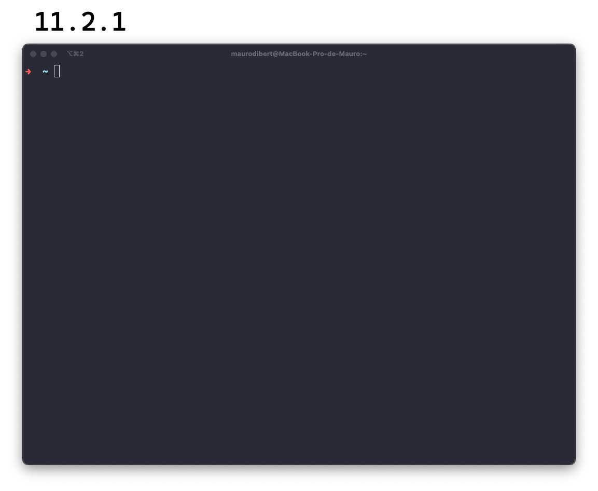
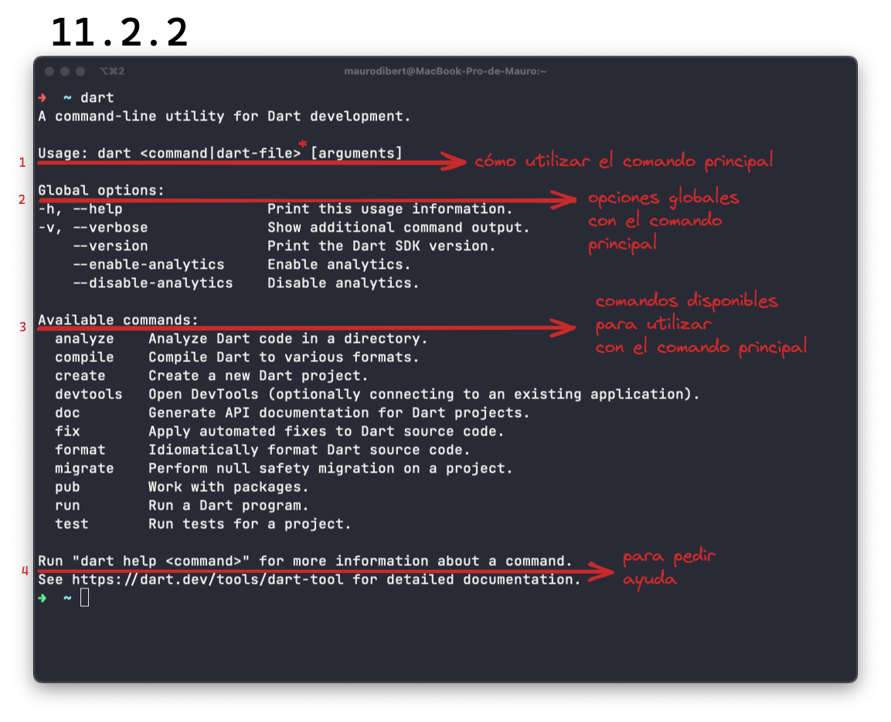

# La terminal

Hemos visto muy superficialmente cómo crear un proyecto desde VSCode. O para ser más honestos, hemos visto cómo crear algunos archivos `.dart` mas no un proyecto.

Para hacerlo podemos recurrir a VSCode o bien dedicarle un breve tiempo a conocer la línea de comandos y permitir sentirnos verdaderos hackers, listos para cambiar la tierra con nuestros dedos! 🤣

## Introducción

Antes de que digan que les da muchísimo miedo siquiera mirarla en la computadora de alguien más, es un buen momento para amigarnos y utilizarla gradualmente.

Estamos acostumbrados a manejarnos con __menúes, ventanas y mouse__, lo que sería propiamente definido, la __interfaz gráfica__. Sin embargo, __existe una ventanita en la que podemos dar instrucciones a casi cualquier programa solamente utilizando una línea de texto simple__ u orden. __La terminal__ o interface de línea de comandos (_CLI, command line interface_) __es ese método.__

Para acceder a ella, pueden presionar `cmd + t` o `ctrl + t` o bien buscarla según su sistema operativo.

__Lo primero que van a ver, es el _prompt_ o prontuario__ en español y es la ayuda visual que espera le introduzcamos un comando. En mi terminal que está un poco toqueteada y mínima (😂), van a ver esto simplemente: `-> ~ |` pero esto varía de terminal a terminal:

Hace unos párrafos, mencionamos que uno le ingresa órdenes a la terminal. Como sucede con cualquier lenguaje __estas órdenes tienen que estar en orden__ porque sino la terminal como sucedería con otras personas, no entenderían nada. En una __orden tipo__ la primera palabra indica la orden a ser ejecutada y las palabras restantes se pasan como opciones o parámetros y argumentos de la orden: `-> ~ orden [ opciones ] [ arguments ]`

__Las opciones son diferentes posibilidades de usar el comando y las podemos ingresar utilizando `--` antes de la opción, o un solo `-` antes de la abreviatura__ de la opción, que puede ser la primer letra o las primeras dos. Por ejemplo tenemos el comando `dart`, que vendría ser una utilidad en la terminal para desarrollar en Dart. Si solo tecleamos `dart`, esto es lo que nos aparece:

1. Nos cuenta cómo utilizar `dart`: primero el comando `dart`, luego un espacio y otro comando, archivo (y yo voy a agregar ahí mismo donde ven el '*') una opción global para luego otro espacio y argumentos si los hubiere.
2. Las mencionada opciones globales en las que pueden pedir ayuda por un comando ya sea el principal (`dart --version`) o un subcomando (`dart analyze --help`).
3. Los comandos disponibles.
4. Cómo pedir ayuda de una forma distinta, ya no `dart analyze --help` sino `dart help analyze`.

Noten que el espacio aquí importa mucho! Si queremos por ejemplo crear un directorio utilizaríamos el comando `mkdir` seguido del nombre del directorio pero cómo crearían un directorio llamado así 'directorio extra'? Si lo escriben con espacios (`mkdir directorio extra`) va a crearles dos directorios, uno llamado 'directorio' y el otro llamado 'extra'.

Para lograrlo deberían rodearlo de comillas simples o dobles: `mkdir 'directorio extra'`. Y ya que están creando un montón de directorios, para borrarlos pueden utilizar `rm -R [nombre_del_directorio]`. Y por qué la opción `-R`? 💀 Pueden investigarlo ustedes mismos utilizando el comando `man [comando]`, que les va a traer el manual de dicho comando! Para salir del manual, pueden presionar la tecla `q`.

Buscaron!? Lo que hace la `-R` es hacer recursiva la eliminación ya se trata de un directorio que puede contener más archivos o directorios.

Por otro lado, van a ver cuando empiecen a investigar un poco, las palabras 'su' y 'sudo'. No se los dije antes, pero __cada sistema operativo funciona con distintos usuarios los cuales cuentan cada uno con diferentes roles__, lo que nos permite evitar que __alguien__ que no debe __haga algo que no debe__.

__El usuario más poderoso se llama `root`__ y es quien tiene todos los permisos. Si ustedes teclean `su`, les va a pedir el _password_ para loguearse como dicho usuario. En Mac por ejemplo, dicho usuario está desactivado por defecto. Por otro lado, si uno teclea `sudo` (_Super User DO_), dota al usuario actual de permisos de administrador.

Como para terminar esta capaz no tan breve introducción, les dejo un listado de comandos que les pueden resultar de mucha utilidad. Ah! Antes: si alguna vez se quedan en la mitad de un comando o un proceso, pueden utilizar `ctrl + c` para salir de allí! Ahora sí, los comandos:

- `top`: les muestra un listado de los programas en uso con su _PID_ o _program id_. Vale aclarar que un _id_ es un identificador, se aplica a millones de situaciones pero sirve exactamente para saber que un objeto es específicamente ese objeto.
- `killall [comando del programa]`: mata o termina un programa utilizando su comando. Por ejemplo: `killall code`.
- `kill PID`: mata un programa utilizando su PID. Por ejemplo: `kill 4320`.
- `ls <opciones> <ficheros>`: lista el contenido de un directorio.
- `cp <opciones> <archivo> <ruta>`: copia un archivo o directorio en el directorio especificado.
- `mv <opciones> <archivo> <ruta>`: mueve un archivo o directorio a un archivo o directorio. Se utiliza también para renombrar; el origen y destino es un archivo.
- `cat <opciones> <archivos>`: muestra por pantalla el contenido de los archivos por la salida estándar.
-`find <ruta(s)> <condición(es) de búsqueda> <acciones>`: busca archivos recorriendo árboles de directorios especificados por las rutas, evaluando de izquierda a derecha las condiciones de búsqueda. Además se pueden especificar acciones sobre los resultados obtenidos.
-`pwd <opciones>`: Muestra el nombre del directorio en el que uno se encuentra situado (_print working directory_).

Espero que tengan suficiente para meter sus manitas a explorar, probar y hacerlo sobre todo frente a personas innotas para hacerse ver como superhéroes del teclado! 🦸‍♂️
