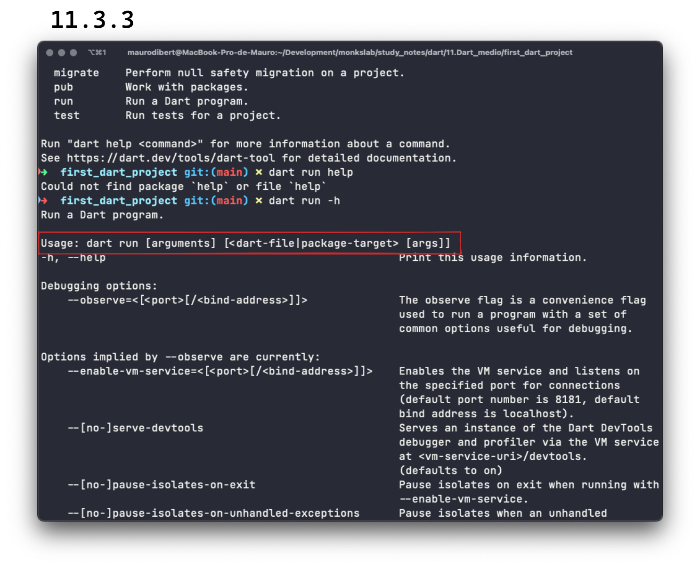
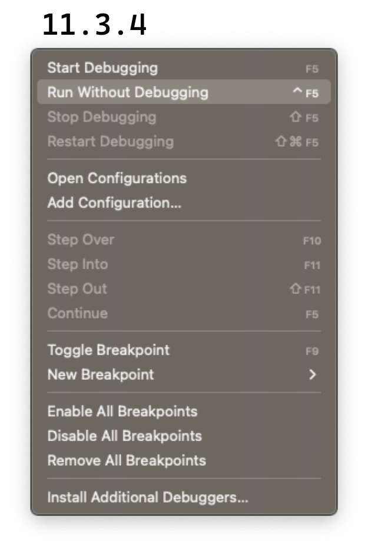

# Crear y correr un proyecto

Hasta el momento, nos manejamos casi todo el tiempo con Dartpad salvo en reducidas circunstancias. Ha llegado el tiempo de pegar el salto: vamos a trabajar casi absolutamente con VSCode de ahora en adelante dejando Dartpad para pequeños experimentos.

Allí, en VSCode, hemos creado archivos Dart y trabajado en ellos. Llegó también el tiempo de expandirnos un poco a través de los proyectos y para crearlos, podemos hacerlo de dos maneras: la terminal y VSCode. Empecemos por la más rockera! 🤘

## Crear un proyecto

Ya conocemos el comando `dart` y si lo ingresan a su terminal, van a poder observar que uno de sus comandos es `create`. Si luego introducen __`dart create`__ van a ver que solamente podemos utilizarlo para pedir ayuda (`-h`) o __para utilizar un _template_ que es como un modelo para crear nuestro proyecto__.

Vamos a utilizar el primero de los _templates_ para __crear una aplicación para línea de comandos__. Introducimos entonces: `dart create -t console first_dart_project` y damos enter. Dart está creando el proyecto por nosotros! Para ingresar,... 💀 Ya tienen todos los elementos para abrir una instancia dentro de esa carpeta desde allí en VSCode! Prueben!

Probaron? Era simplemente entrar a esa carpeta utilizando `cd first_dart project` (recuerden que si introducen los primeros caracteres del nombre del directorio y luego la tecla `tab`, se los autocompleta) y allí `code .` (siendo `.` el directorio en el que nos encontramos).

Súper! Ya están dentro de su primer proyecto! 💪

Cómo podríamos __hacerlo desde VSCode__? Dentro de VSCode introducen la combinación de teclas `cmd/ctrl + shift + p` y allí teclean primero `dart`. Les va a listar todo lo que VSCode puede hacer con este comando siendo 'New Project' una de esas opciones. Haciendo click o presionando `enter` allí, luego les va a pedir que seleccionen el tipo de proyecto. Como queremos crear lo mismo que lo que hicimos en la terminal, seleccionan 'Console application', luego el directorio donde la quieren crear y finalmente el nombre.

Listo! Ahora ya saben cómo se crea un proyecto desde ambos lugares! Ah! 💀 Una tareita: vuelvan a crear otro proyecto desde VSCode y observen qué sucede en la barra inferior de VSCode cuando terminan de poner el nombre del proyecto y dan enter.

Pudieron ver algo? VSCode corre también en su terminal propia, el comando `dart create -t console <nombre_nuevo>`.


## Correr un proyecto

Ya vamos a ver cómo se estructura cada proyecto que creemos pero ahora vamos a concentrarnos en cómo correr el proyecto que acabamos de crear.

Cómo ya saben, Dart necesita una función `main` que es el punto de entrada de nuestra aplicación. Dicha función se encuentra dentro de la carpeta `bin` y dentro del archivo que lleva el mismo nombre del proyecto que acabamos de crear.

A su vez, si observan dicha función, pueden ver que llama a otra utilizando un `import` al que le agrega la palabra `as`, lo que hace que todo el archivo se llame con el nombre que le asigna, en este caso `first_dart_project`.

Esta otra función, `calculate`, se encuentra dentro de un archivo otra vez con el mismo nombre que el del proyecto pero en la carpeta `lib`.


Ahora que ya tenemos un idea mínima de dónde están nuestras funciones principales, les puedo decir que podemos correr nuestro programa desde dos lugares. Empecemos por la terminal.

### Correr nuestro programa desde la terminal

Si ustedes ingresan el comando `dart`, van a ver que uno de los últimos comandos disponibles es el `run` (correr). Si ingresan entonces `dart run` estando dentro de la carpeta del proyecto vale aclarar, Dart sabe automáticamente cuál es el archivo que contiene su `main`, de qué archivo se trata, en qué carpeta está y corre su programa sin problemas. 💀 Vayan a ver qué pasa si mueven ese archivo que está dentro de la carpeta `bin` a otra ubicación?

Cuando creamos un proyecto de consola por _template_, se crea con una estructura determinada (que respetamos y seguimos como buena práctica), por lo que Dart sabe dónde está cada cosa. Si las cambiamos de lugar, no puede correr nuestro programa con el comando `run` así sin más. Sin embargo, si le proveyéramos del _path_ o locación precisa de nuestro archivo luego de `dart run` (`dart run ./locacion_de_nuestro_archivo/su_nombre.dart`), también lo correría.

Qué pasa sin embargo si modificamos un poco la función principal para utilizar sus argumentos? Algo así:

```dart
import 'package:first_dart_project/first_dart_project.dart'
    as first_dart_project;

void main(List<String> arguments) {
  print('Hello world: ${first_dart_project.calculate()}!');
  for (var argument in arguments) {
    print(argument);
  }
}
```

Simplemente vamos a recorrer los argumentos recibidos desde la línea de comandos e imprimirlos uno por uno.

💀 Tratemos entonces de correr `dart run 1 2 3`. 😯 Nos dice _Could not find package `1` or file `1`_. Dice que no puede encontrar el paquete `1` o el archivo `1` y esto es porque luego de `run`, Dart está esperando primero argumentos para el comando `run` y luego el nombre de un archivo que puede recibir sus propios argumentos. Esto lo pueden ver si corren `dart run -h` para pedir la ayuda:



Y cómo haríamos entonces, según dicha ayuda, para introducir argumentos? 💀 Tómense un tiempito para probar!

Probaron? Tienen que ingresar el _path_ del archivo y recién luego, los argumentos: `dart run ./bin/first_dart_project.dart 1 2 3`.

### Correr nuestro programa desde VSCode

Si se fijan en los menús de VSCode, van a encontrar uno de ellos bajo la palabra _Run_. Si se posan sobre él, van a encontrar una opción que dice _Run Without Debuggin_ y a su derecha la combinación de teclas que pueden utilizar para hacer más rápido; es muy buena idea ir memorizando estas combinaciones. Dicha opción es la que se encarga de correr nuestro código:



Nuevamente, vieron que lo corre perfecto siempre que estemos dentro del mismo archivo. Pero qué sucede si intentamos correr dicho programa desde otro lugar? VSCode nos creará un archivo llamado `launch.json`, dentro de una carpeta `.vscode`. Vamos por partes:

_Launch_ significa lanzar y este archivo nos sirve para configurar cómo queremos lanzar o correr nuestra aplicación.

Luego, vemos que se encuentra dentro de un directorio en el que su nombre comienza por un `.`. Esto indica que dicho directorio es oculto y solo podemos verlo en VSCode pero si en su directorio corremos el comando `ls`, no lo veremos salvo que le agreguemos la opción `--all`.

Podrán observar que dicho archivo es un `Map` o algo así (es la manera en la que es estructuran los archivos `json`). Dentro del _key_ `"configurations"`, tenemos una lista de otros `Map`. Si a dicho objeto le agregamos el comando/key `"program"` y a dicha _key_ le asignamos el valor que representa el _path_ o ubicación de nuestro archivo, no importa donde nos encontremos, VSCode correrá ahora sí el archivo por nosotros:

```json
{
    // Use IntelliSense to learn about possible attributes.
    // Hover to view descriptions of existing attributes.
    // For more information, visit: https://go.microsoft.com/fwlink/?linkid=830387
    "version": "0.2.0",
    "configurations": [
        {
            "name": "first_dart_project",
            "cwd": "dart/11.Dart_medio/first_dart_project",
            "request": "launch",
            "type": "dart",
            "program": "bin/first_dart_project.dart"
        }
    ]
}
```

Presten atención que hay una _key_ llamada `"cwd"` y se refiere al _current working directoy_ o el directorio en el que estamos trabajando. En mi caso, va a ser distinto del suyo (posiblemente no lo tengan siquiera), ya que ustedes están trabajando en un proyecto nuevo, no como yo que estoy haciéndolo como parte de los ejemplos del curso.

Ahora bien, cómo sumamos nuestros argumentos? _Easy_ (fácil)! Sumamos otra _key_ llamada `"args"` y como valor, una lista de los argumentos que queremos:

```json
{
    // Use IntelliSense to learn about possible attributes.
    // Hover to view descriptions of existing attributes.
    // For more information, visit: https://go.microsoft.com/fwlink/?linkid=830387
    "version": "0.2.0",
    "configurations": [
        {
            "name": "first_dart_project",
            "cwd": "dart/11.Dart_medio/first_dart_project",
            "request": "launch",
            "type": "dart",
            "program": "bin/first_dart_project.dart",
            "args": [
                "1",
                "2",
                "3"
            ]
        }
    ]
}
```

Voilá! Ya pueden correr su primer proyecto desde VSCode también! De hecho, pueden hacerlo super rápidamente si van a su archivo `first_dart_project.dart`, localizan el `main` y dan click justo encima donde dice: _Run_. He aquí la versión rápida! 😂

Y ya vista la versión rápida de _Run_, habrán visto junto a esta, otra llamada _Debugg_. Y eso? Próximo capítulo!
