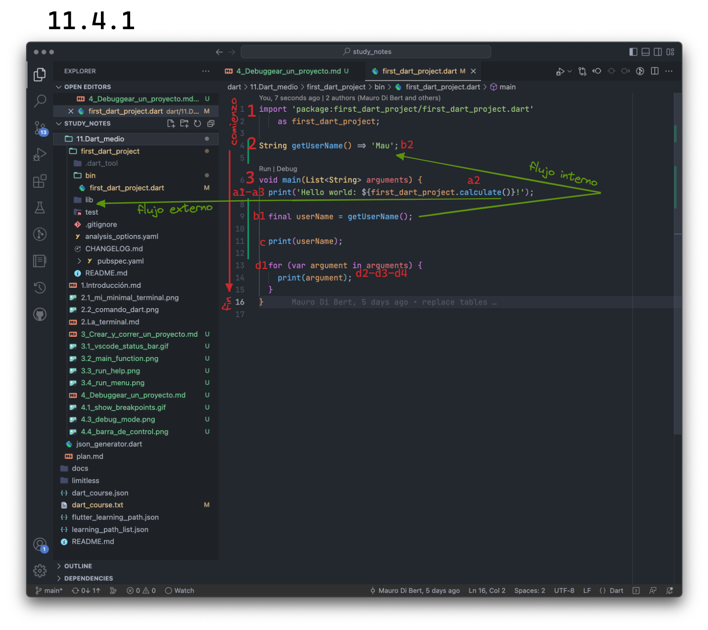
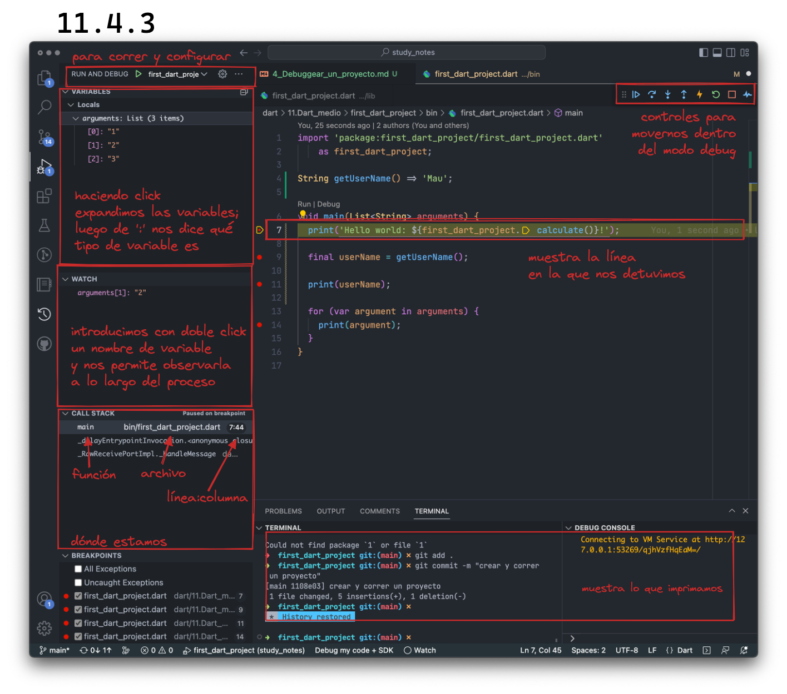
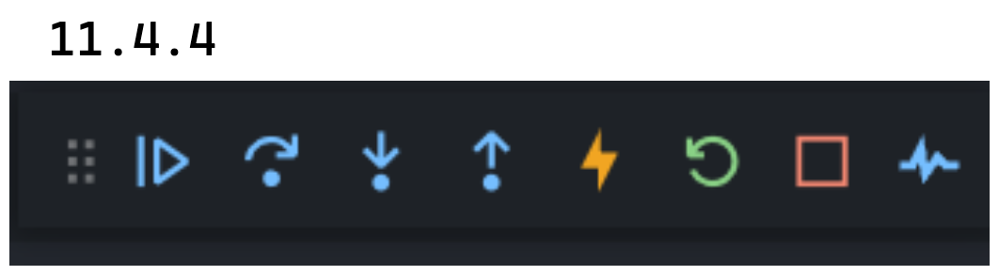

# Debuggear un proyecto

_Debug_ significa depurar y al correr nuestro programa en modo de depuración, podemos __ir ejecutando nuestro programa paso a paso__, ver qué valor ocupa cada variable, cuál es el recorrido que va haciendo y varias cosas más. De esta manera podemos cerciorarnos de que todo se ejecuta de la forma esperada por nosotros y si no lo hace, nos sirve para encontrar su por qué.

Pero antes de hablar específicamente de cómo hacerlo, es importante entender cómo un programa corre.

## Control y _Call Stack_

Sin importar el lenguaje de programación, el __control de un programa marcha de arriba hacia abajo, yendo lo más abajo que pueda__; cuando dicho control llegó abajo de todo, cuando terminó de leer todos los _statements_, ha terminado. No obstante, el programa puede volver hacia arriba utilizando _loops_ y funciones pero naturalmente su direccionalidad es descendente.

Vamos a tomar como ejemplo, nuestro `first_dart_project.dart` con algún agregado:

El __primer paso__ sería __importar otros archivos__ para luego poder utilizarlos. Recuerdan la idea del control yendo hacia abajo? Es por esto que nuestros _import_ van arriba de todo, para poder utilizarlas luego en nuestro archivo.

__Luego__, __definimos una función__ llamada `getUserName` y si bien aquí lo hacemos al principio __para que el control pueda llamarla luego__ y como una buena práctica, en Dart no es necesario de forma estricta ya que si dicha función o variable se encuentra dentro del archivo, es suficiente para que Dart pueda encontrarla; recomendamos hacerlo al comienzo ya que facilita mucho la comprensión, sobre todo en casos más complejos.

__De manera seguida, tenemos nuestra función `main` que es la que llamará Dart al correr la app__ y que a su vez tiene un control propio una vez ejecutada. Hasta este momento, es lo que pueden ver con los números grandes 1, 2 y 3.

Cuando corremos el programa y la función `main` es llamada, podemos ver lo que sucede con las letras:

1. _a1_: llega a la línea del `print` pero primero...
2. _a2_: tiene que hacer el cálculo (`calculate`) y el flujo sale a otro archivo (`lib/first_dart_project.dart`).
3. _a3_: una vez con el resultado (`42`), puede imprimir.
4. _b1_: va a declarar una nueva variable pero primero...
5. _b2_: tiene que obtener el valor de `getUserName` para inicializarla e...
6. _c_: imprimirla.
7. _d1_: se da comienzo a un _loop_,
8. _d2-d3-d4_: que imprime uno a uno los argumentos (`[1, 2, 3]`).

__La manera en la que nuestra computadora _trackea_ o sigue todos estos pasos es a través de algo que se llama un _call stack_ o pila de llamadas.__ Imaginen esto como una pila de libros: primero ponemos el `main`, es el primero que llamamos o leemos (`stack: main`). Pero una vez en el capítulo 1, nos damos cuenta que tenemos que leer el libro `calculate` y lo ponemos encima de la pila (`stack: main | calculate`) hasta que lo terminamos de leer. Lo sacamos para imprimir ese resultado (`stack: main`) y al llegar al capítulo `username` nos damos cuenta que necesitamos otro libro. Vamos (`stack: main | getUserName`), lo abrimos, leemos lo que necesitamos y nos volvemos con la información nueva para utilizarla (`stack: main`). Así __vamos apilando__ libros o en este caso __bloques de código a medida que el control fluye de arriba hacia abajo__.

Todo lo anterior, fue la base para que podamos entender en qué orden sucede la cosa y poder ponernos a debuggear nuestro programa como corresponde. Y podemos hacerlo desde dos lugares:

## Debuggear desde VSCode

Como ya vieron cuando estaban aprendiendo cómo correr un proyecto en VSCode, pueden correrlo en modo _debuggin_ eligiendo la primera opción del menú _Run_, _Start debuggin_, apretando `F5` o bien sobre la función en cuestión que quieren debuggear (Exacto! Pueden debuggear puntualmente un pedazo del código que esté listo para correr, esto es, que aparezca encima de él un `Run|Debug`).

💀 Por un lado espero que no hayan sido tan ansiosos de haber apretado para ver qué pasaba pero por el otro me hubiera encantado que les ganara la curiosidad! 🤣 Vayan a probar y observen qué sucede cuando corren su _'first_dart_project'_ de esta manera.

Bien, lo primero que van a notar que VSCode hace, es abrir el panel izquierdo en la pestaña de _Run and Debug_, la que tiene el botón de _play_ y el _bug_ o bichito; si se paran encima de ella van a ver su nombre y el atajo de teclado para llamarla ustedes cuando quieran.

🪲 _Side note_: Creo haber leído por allí que el nombre _bug_ surge porque en una de las primeras enormes computadoras creadas, algo fallaba y descubrieron que había un bicho que estaba provocando la falla. 😯

Cómo hacemos que algo de esto funcione? Vamos a utilizar _breakpoints_. __Los _breakpoints_ son puntos de interrupción que detienen la ejecución de nuestro código donde los hayamos colocado__ hasta que el programador decida moverse a otro punto. En la pestaña de la izquierda van a ver abajo de todo por lo general (no siempre está allí ya que cada parte de VSCode puede ser reacomodada), un área llamada _BREAKPOINTS_. Allí pueden ver cómo __se agregan a medida que los colocamos__. Cómo lo hacemos? __Junto a los números de línea hacemos click cuando vemos el puntito rojo atenuado. Éste se vuelve rojo fuerte y listo__. Cuando están colocados pero desactivados, los vamos a ver en gris:

Vamos a poner cuatro _breakpoints_ en las líneas 7, 9, 11 y 14 y a correrlo. Recuerden hacerlo con el comando `F5`, en el menú que ya conocen o en la pestaña que acaban de conocer en el botón de _play_. De esta manera vamos a correrla con los argumentos que configuramos en el archivo `launch.json`. Una vez corriendo, les voy a explicar un poquito con una imagen:

Ya que tenemos ahora una idea general de este modo, vamos a ir cubriendo cada control a medida que vamos viendo ejemplos para entenderlo.

Lo primero es poder controlar cómo nos movemos en este modo y para eso utilizaremos la barra de control en la esquina superior derecha:

Vamos por partes:

- _Primer botoncito que no sé cómo se llama_ (😂): A su izquierda, pueden ver __dos columnas de tres puntitos cada una__ y cuando pasan el cursor encima, se transforma en una mano: nos sirve para __mover dicha barra__. Atención que solo se mueve una línea hacia abajo y a lo largo de todo VSCode.
- _Continue/Pause_ (`F5`): _Continue_ sigue con la ejecución del programa hasta que encuentra otro _breakpoint_ mientras que en _Pause_ podemos inspeccionar el código de la línea en la que estamos parados y movernos línea por línea.
- _Step Over_ (`F10`): ejecuta el siguiente método como si fuera un comando único, sin inspeccionarlo o siguiendo en los métodos o funciones internas de éste. Por ejemplo estuviéramos en un _for loop_, NO entraría y ejecutaría cada iteración.
- _Step Into_ (`F11`): entra al método siguiente y lo ejecuta línea a línea. Por ejemplo estuviéramos en un _for loop_, SÍ entraría y ejecutaría cada iteración.
- _Step Out_ (`Shift + F11`): si estamos dentro de un método, retorna al contexto en el que estaba cuando este método fue llamado, completando los pasos restantes como si se tratara de un comando único. Por ejemplo estuviéramos en la segunda iteración de un _for loop_, saldría habiendo primero ejecutando todas juntas cada iteración restante pero sin detenerse en cada una.
- _Hot Restart_ (`Ctrl + F5`): lo veremos en Flutter.
- _Restart_ (`Shift + Cmd/Win + F5`): termina la ejecución del programa y la reinicia en modo debug.
- _Stop_ (`Shift + F5`): termina la ejecución.

Bien! Vamos a utilizar estos controles y movernos paso a paso, aprendiendo sobre cada una de las áreas de VSCode en el camino.

1. Hagan click en _Step Into_: Van a ver que saltamos a otro archivo, que allí no tenemos variables disponibles y que entonces en el _CALL STACK_, podemos ver como `calculate` se puso encima de `main` pero que si queremos podemos, haciendo click, volver al `main`, aunque la ejecución no se altera: si hiciéramos click en _Step Into_ volvería el foco al `calculate` pero ahora dentro del método.

2. (Hicimos ya click en _Step Into_ para probar) Hagan click en _Continue_ y van a observar cómo volvemos al `main` y el _Call Stack_ se limpia. Luego, hagan click en _Step Into_ y van observar el ingresar dentro de una función (`getUserName`) pero ya no salta a otro archivo sino que lo hace dentro del mismo. Después hagan click en _Continue_ y salta al siguiente _breakpoint_ ya con el resultado de la variable que podemos observar posándonos arriba o bien en el sector de _VARIABLES_.

3. Una vez más click en _Continue_ y así hasta terminar: Entra directamente a la primera iteración del búcle y pueden ver cuál es el argumento posándose encima o en el sector _VARIABLES_ y cómo se van imprimiendo, hasta que llega al fin de la ejecución, siendo esto marcado por la consola como _Exited_.

Ya han debuggeado su primer programa! 👏 La idea es que __de ahora en adelante, cada vez que ejecuten un programa que están escribiendo, utilicen este mecanismo__ para seguir su recorrido. De esta forma no solo van a fortalecer las bases absorviendo el _flow_ en cada ejecución sino que van a tener seguridad de todo lo que sucede y __van a haber adiestrado la herramienta primordial para descubrir bugs de cualquier tipo__.

## Ejecutarlo desde las DevTools

Esto lo vamos a dejar para la última parte de nuestro curso, la sección avanzada!
