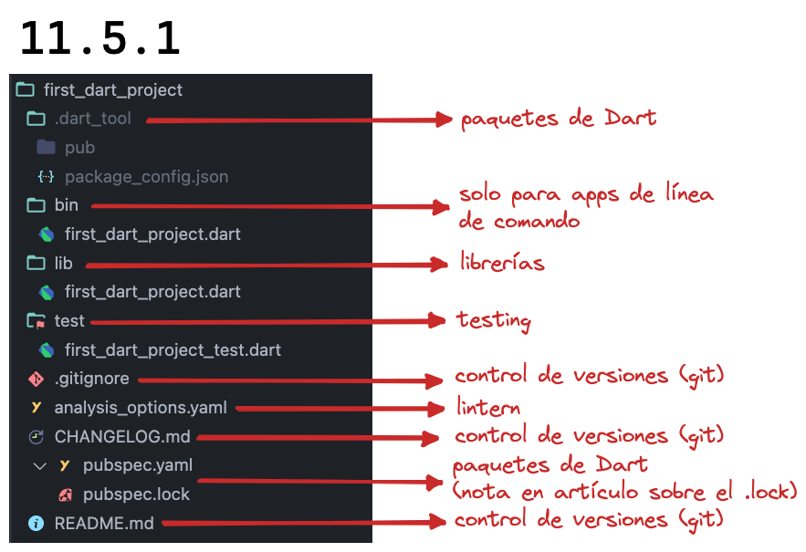
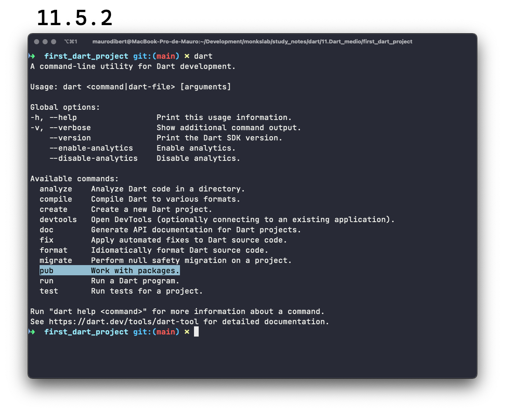

# Componentes de un proyecto

Vamos a basarnos en nuestro flamante `first_dart_project` para poder entender de qué está hecho un proyecto:



__Nota sobre .lock:__ recuerdan que los archivos que comenzaban con un punto, eran archivos ocultos? Esa captura está hecha en mi VSCode que tiene instalada una extensión que los oculta junto con su archivo asociado, mostrando el que no es oculto; si quisieran hacerlo visible, tienen que hacer click en la flechita a la izquierda del nombre. En la captura, pueden ver que está siendo mostrado y la flechita apunta hacia abajo.

__Nota sobre _linting_:__ es el proceso por el cual se analiza nuestro código y, siguiendo una serie de reglas, determina si está correctamente escrito. Por ejemplo, podríamos poner una regla que verifique que estén puestas todas las _trailing commas_ y de faltarnos una, nos avisa o hasta dependiendo de la forma en que configuremos nuestro editor, las agregue solo al guardar el archivo.

## Paquetes

Hasta ahora siempre hablamos de haber creado el primero proyecto de Dart pero en realidad, siendo específicos, __no existe tal cosa llamada proyecto en Dart sino, lo que verdaderamente tenemos son paquetes__ o _Dart packages_.

__Podemos encontrar una enorme cantidad de paquetes curados, reankeados y comentados en [pub.dev](https://pub.dev/),__ que es el repositorio oficial para _packages_ tanto de Dart como de Flutter.

Cuál sería la utilidad de ellos y la de reunirlos todos en un solo lugar? Imaginemos que tenemos que escribir una aplicación para buscar en un servidor una serie de datos, luego transformarlos desde su formato JSON original a clases que tenemos en nuestra app y finalmente almacenarlos en una base de datos.

Imaginen si tuviéramos que escribir todo eso en Dart? Nos volveríamos locos o por lo menos, habríamos consumido enormes cantidades de tiempo en ello. Sin embargo ya hay una __gran colección de paquetes elaborados y mantenidos por un hermoso grupo de personas (la comunidad) que se encargan de hacer estas cosas y muchas más, ahorrándonos impensadas cantidades de tiempo y recursos,__ todas reunidas en el mágico [pub.dev](https://pub.dev/).

Así, un paquete puede depender de otros y viceversa. __Un paquete que es útil para el ecosistema y está subido a _pub.dev_, se llama librería o _library_,__ mientras que __un paquete específico de una aplicación se llama _application package_ o paquete de aplicación.__ 🙄

Cómo hace entonces Dart para manejar estos paquetes? Utiliza un _package manager_ que podemos observar cuando escribimos en la terminal el comando `dart`:



Así, cuando creamos un paquete se encarga de a su vez de traer todos los paquetes de los cuales el nuestro depende y lo hace revisando el archivo `pubspec.yaml` y mediante el comando `dart pub get`.

En dicho `pubspec.yaml` de manera obligatoria tenemos que establecer el nombre de nuestro paquete y las _constraints_ o las versiones mínimas y máximas del _sdk_ del que vamos a depender, lo que sería igual a decir las versiones mínimas y máximas de Dart. Fíjense que en nuestro archivo están puestas de la siguiente manera: `'>=2.18.6 <3.0.0'`, pudiendo utilizar la versión 2.18.6 o superior pero no más que la 3.0.0 siendo esta no incluida.

Finalmente tendremos dependencias para la ejecución de nuestro programa y dependencias para cuando lo corremos en modo desarrollo:

```yaml
name: first_dart_project
description: A sample command-line application.
version: 1.0.0
# homepage: https://www.example.com

environment:
  sdk: '>=2.18.6 <3.0.0'

# dependencies:
#   path: ^1.8.0

dev_dependencies:
  lints: ^2.0.0
  test: ^1.16.0

```

__Nota__: tengan en cuenta que los espacios y la indentación en este archivo son respetados a raja tabla y si tenemos uno de más o de menos, va a provocar un fallo.

Cuando `dart pub get` se corre o lo corremos, otros archivos son generados como el que ya vimos `pubspec.lock` y el `package_config.json` (en la carpeta `.dart_tool`), en donde se especifican los paquetes de los cuales no solamente nuestro paquete depende en forma directa sino también indirecta, refiriéndose a los paquetes de los cuales los paquetes de los que dependemos, dependen! 🥴 Intento otra vez espero más fácil: los paquetes de los que dependemos explícitamente y los paquetes de los que ellos dependen.

Podemos ver en la siguiente captura dichos archivos y al final del `package_config.json` como se encuentra nuestro propio paquete, siendo esto la prueba final para fundamentar que no existen proyectos mas solo paquetes! 🤣


Ahora que entendimos un poco qué son los paquetes y vimos que hay otras personas que hacen mucho trabajo del que nosotros tomaremos gustozamente provecho, cómo hacen ellos y ellas para hacer público lo que quieren que veamos y vamos a utilizar nosotros?

## Librerías

Las _libreries_ son las partes públicas de un paquete y es lo que en nuestro proyecto representaría la carpeta `/lib`, aunque dichas librerías exigen una forma específica de organizar sus carpetas y archivos, cosa que veremos pronto. Podríamos sin embargo, ayudarnos a escribir mejor código para estas librerías utilizando un poquito de ayuda...

## Linting

Recuerdan el _static analyzer_ que tenía la función de __analizar en tiempo real cualquier error potencial en nuestro código__? Y cómo se da cuenta? Básicamente __sigue una serie de reglas__ o _lint rules_ y este proceso se llama _linting_ (_lint_ significa 'pelusa' y si bien el término original proviene de una utilidad de Unix personalmente creo que se creó pensando en sacar toda la pelusa que está ensuciando la cosa 🤣).

Sería muy interesante si pudiéramos ver cuáles son estas reglas o incluso agregar algunas nuestras! Si tan solo...

Observen en su archivo `pubspec.yaml`, dentro de `dev_dependencies:` que la primera refiere a una librería llamada `lints` (en su versión `^2.0.0`). Esta librería es la que contiene las reglas y podemos verla dentro del mismísimo VSCode: busquen el panel DEPENDENCIES, allí la carpeta `/lib` y luego al archivo `recommended.yaml`. Van a poder ver cada una de las reglas que se utilizan encima de las esenciales dispuestas en el archivo `core.yaml`:


Pero podemos configurar más este proceso? Sí! En el archivo `analysis_options.yaml`:

```yaml
# Primero, inclumos del paquete `package:lints`, lo recomendado.
# Si queremos algo menos estricto, podemos utilizar el core.yaml y agregar las que querramos.
include: package:lints/recommended.yaml

# Aquí podemos especificar otras reglas extra como sería el caso de usar trailing commas
linter:
  rules:
    require_trailing_commas: true

# Aquí podemos excluir ciertos archivos del análisis
analyzer:
  exclude:
    - path/to/excluded/files/**

# Para más info, nos manda a:
# https://dart.dev/go/core-lints
# https://dart.dev/guides/language/analysis-options
```

En la sección avanzada de este curso vamos a ver cómo basarnos en un linting más estricto como convención pero por ahora quedo conforme con que conozcan cómo configurarlo para poder ir gradualmente introduciendo mejores prácticas.

Y hablando de ellas, con ustedes, la reina de las mejores prácticas!

## Tests

Una de las cuestions más omitidas, dejadas de lado y temidas cuando uno empieza a estudiar programación. Digo esto lastimosamente porque creo que es __uno de los pilares del proceso de desarrollo__, algo que debiera estar integrado a nuestro proceso cotidiano ya que __nos ayuda a escribir código más mantenible y seguro, acelerar el proceso de desarrollo y permitir su escalabilidad.__

Los tests se pueden encontrar dentro de la carpeta que lleva el mismo nombre y si vamos a nuestro ejemplo, podemos observar un test escrito para asegurarnos de que la función `calculate` nos entrega el resultado correcto. Este tipo de test se llama _unit test_ o test unitario y ya vamos a ver pronto muy pronto, qué significa.

Podemos correrlos desde:

- la terminal con el comando `dart test` dentro de la carpeta del paquete
- desde VSCode, en la pestaña de 'Testing' y haciendo click en el ícono
- desde la misma función dentro del archivo haciendo click en 'Run'


