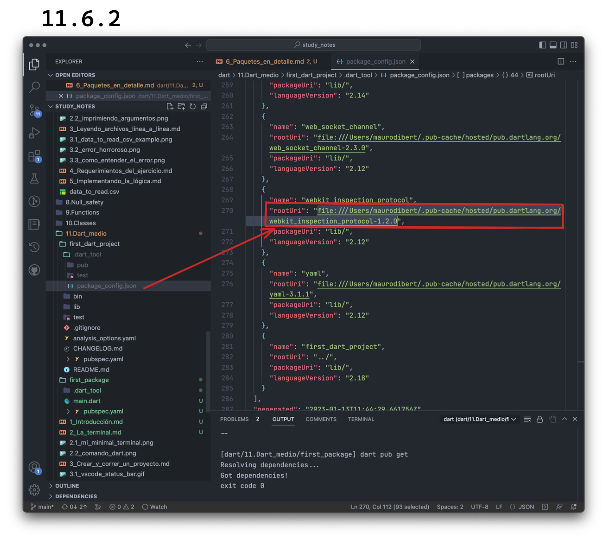

# Paquetes en detalle

Ya tuvimos un breve pantallazo sobre los componentes principales de un proy... paquete! 🤣 Vamos ahora a adentrarnos un poquito más en los _packages_!

Recordemos que un paquete de Dart contiene como mínimo, un archivo llamado `pubscpec.yaml` y que el ecosistema utiliza librerías para compartir funcionalidad, todo a través de un _pub package manager_ o gestor de paquetes.

Vamos a empezar nuevamente, creando un paquete pero ahora desde cero. Creemos primero una carpeta nueva en la terminal llamada `first_package`, entremos a ella, abramos VSCode en ella y creemos un archivo llamado `main.dart`:

```shell
mkdir first_package
cd first_package
code .
```

Dicho archivo puede contener algo simple como esto:

```dart
void main() {
  print('This works! And has no pubspec!');
}
```

Y si ustedes prueban correrlo, funciona verdad? Sin embargo qué pasa si tratan de sumar una librería para tener _linting_ automático en su código? Por ejemplo hacen en la terminal `dart pub add lints`? 💀 Vayan y prueben ustedes solitos y traten de explicar el error!

_Could not find a file named "pubspec.yaml" in "/Users/maurodibert/Development/monkslab/study_notes/dart/11.Dart_medio/first_package"._ Básicamente nos dice que no encontró un `pubspec.yaml` que es el encargado de relacionar y buscar paquetes!

Vamos a agregarlo con lo mínimo necesario. Recuerdan cuáles son esos dos campos? 💀 _Again_ (una vez más), hagan memoria y traten solitos.

Recordaron? He aquí sino el `pubspec.yaml`:

```yaml
name: first_package
environment: 
  sdk: '>=2.18.6 <3.0.0'
```

Un par de cositas al respecto!

Por empezar, vieron que si empezaron creando su archivo en el VSCode con su tipo de archivo correctamente definido (`.yaml`), apenas escriben la `n` de name, debería aparece un menú con un ícono de una herramienta y la palabra `name`. Esto nos ayuda a saber todas las _keys_ que podemos encontrar en este archivo. A su vez, podemos ver que moviéndonos por ese menú, nos dice a qué refiere dicha _key_.

Tengan en cuenta que el `name` tiene que estar en _underscore_ y si lo piensan publicar, no puede haber ya un paquete publicado con ese nombre. Pueden buscarlo en [Pub.dev](https://pub.dev/packages).

Luego, cuando hacemos lo mismo con `environment` lo hace seteando una versión baja por defecto y nos dice que no es recomendable hacerlo por lo que la subo y termino borrando la de Flutter que por el momento no la necesitamos:

Finalmente cuando guardo, VSCode corre de manera automática `dart pub get` y se crean los archivos correspondientes:


Ahora sí tenemos un paquete! Y si quieren saber más [sobre este archivo](https://dart.dev/tools/pub/pubspec)... aunque está en inglés! Bueno, vamos a extendernos un poquito en esto utilizando comentarios, así ya aprenden como comentar en un `.yaml`:

```yaml
name: first_package # nombre de su paquete

version: 1.2.3 # número de versión según semantic versioning / ya hablaremos de esto

description: An attempt to create a package without a template # Aquí deberían aprovechar para vender su paquete al mundo ya que es lo que los usuarios van a ver.

homepage: https://first_project.com/home
repository: https://github.com/FirstPackage/first_package
issue_tracker: https://github.com/FirstPackage/first_package/issues
documentation: https://first_project.com/docs

# Direcciones de websites con info, repositorio donde se aloja, issues o cuestiones que discutan con la comunidad sobre su paquete y documentación

executables:
  first_package: main # Esto haría que desde la terminal, una vez que el paquete está activado como global utilizando `pub global activate`, si tipean first_package va a correr el main.dart

publish_to: none # Utilizan `none` si no lo van a publicar; el default es pub.dev site

environment:
  sdk: '>=2.18.6 <3.0.0' # Un paquete puede funcionar solo con algunas versiones del SDK; esto sirve para especificar con cuales

dependencies:
  bloc: ^8.1.0 # Los paquetes externos de los cuales el nuestro depende para funcionar

dev_dependencies:
  test: ^1.16.0 # Los paquetes externos de los cuales el nuestro depende mientras utilizamos nuestro entorno de desarrollo
  lints: ^2.0.0 # El signo ^ (caret) representa una syntaxis abreviada y significa desde esta versión hasta la próxima versión mayor sin incluirla o lo que es lo mismo que '>=2.0.0 <3.0.0' en este caso
```

Y ya que vamos en orden, podemos explicar un poquito más del final de dicho archivo...

## _Dependencies_

Vamos a tener varios tipos de ellas:

- _Immediate dependencies_ (directas): son de las cuales nuestro paquete depende directamente y las citadas en el `pubspec.yaml`.
- _Transivite dependencies_ (indirectas): son aquellas de las que dependen nuestras _immedate dependencies_.
- _Regular dependencies_: son las utilizadas durante desarrollo y producción.
- _Dev dependencies_: son las utilizadas solamente durante el desarrollo. Por ejemplo la librería de testing.

Y ya dijomos que podemos utilizar los paquetes alojados en [Pub.dev](https://pub.dev/packages) sin embargo, podemos utilizar otras fuentes también como por ejemplo, si necesitan un paquete que se encuentra en un estado de prueba más avanzado que el publicado estable, pueden depender de un paquete de Git. Git? Ja! Es un buen momento para que sumen a sus horas de estudio y práctica, el [siguiente curso](), ya que Git les va a permitir un millón de cosas y es indispensable para el trabajo profesional en programación.

Podrían entonces utilizar un paquete de Git de la siguiente manera:

```yaml
name: first_package
dependencies:
  bloc: ^8.1.0
  super_package:
    git:  https://github.com/SuperPackage/super_package 
#   git: si necesitan dependen de una rama. Una rama? 🙄 Curso de Git ya! 💪
#     url: git@github.com:SuperPackage/super_package.git
#     ref: develop
dev_dependencies:
  test: ^1.16.0
  lints: ^2.0.0
```

Además, podríamos depender de otros paquetes que tengamos localmente, a través de su _path_ de la siguiente manera:

```yaml
name: first_package
dependencies:
  bloc: ^8.1.0
  super_package:
    path: './packages/super_package'
dev_dependencies:
  test: ^1.16.0
  lints: ^2.0.0
```

Finalmente podemos depender de paquetes dentro de un SDK por ejemplo y por ahora, solamente podemos listar Flutter:

```yaml
name: first_package
dependencies:
  bloc: ^8.1.0
  flutter_driver:
    sdk: flutter
    version: ^0.0.1
dev_dependencies:
  test: ^1.16.0
  lints: ^2.0.0
```

Y dónde se supone que esos paquetes son almacenados una vez que los descargamos? En un directorio _cache_ (directorio de acceso muy rápido) que depende de la plataforma y podemos ver cuál es el nuestro por defecto si vamos a nuestro archivo `package_config.json`, el que se crea una vez que llamamos a `dart pub get`:



## _Semantic Versioning_

Supongamos que creamos un paquete que depende de una librería llamada `super_library` para hacer llamados a un servidor que nos traiga información sobre libros publicados en español. Cuando empezamos a utilizarla, vamos a su documentación que nos dice cómo utilizarla a través de su _API_ o _Application Programmer Interface_ o la interface de uso digamos. Ya entendimos, la hacemos funcionar en nuestro paquete y todo marcha de mil maravillas.

Con el tiempo, esa librería que es muy conocida y con la que mucha gente trabaja, se va actualizando y va mejorando. __Cómo le informa al resto de la comunidad qué va sucediendo internamente__ sin tener los usuarios que estar entrando cada vez a la documentación? __Utilizando versiones! Y _Semantic Versioning_ o versionado semántico es un standar en la industria.__

Esta convención, lo hace a través de tres simples numeritos: 1.2.3

1. _MAJOR_ o cambio mayor: indica que la _API_ cambió y si antes llamabas a un método de una forma, es posible que es método haya cambiado de nombre por ejemplo. Es por eso que se establecen _constraints_: al poner que dependemos de la versión ^2.0.0, cuando la API salte o se actualice a la 3.0.0, nuestro programa va a seguir funcionando porque en las _constraints_ no incluimos la 3.0.0
2. _MINOR_ o cambio menor: se agrega una funcionalidad pero es compatible con las anteriores. Osea que no va a cambiar por ejemplo el nombre del método que llamabas sino que se le va a agregar otra función.
3. _PATCH_ o parche: se soluciona un _bug_ o error pero todo sigue siendo compatible. Por ejemplo ese método que usábamos y generaba un error en digamos, una plataforma específica, ya no lo genera más.

Para más info, refiéranse a [este artículo]() que escribimos con muchos ejemplos y ejercios. También es útil que sepan que cuando utilicen GIT, los archivos encargados de controlar las versiones (en Dart el `pubspec.yaml`) tienen que ser incluidos en el control de versiones para que todos los miembros de un equipo utilicen las mismas versiones!

Están listos para ser desafiados!

## 💪 Creando y dependiendo de nuestros paquetes

__Requirement__:

1. Duplicar el first_dart_project
2. Renombrarlo y llamarlo first_dart_packages_exercise; corrijan todos los `imports`
3. Dentro, creen una carpeta llamada `/packages`
4. Creen un paquete que se llame `calculator` que contenga:
a. Una carpeta `/lib` ya que otros paquetes necesitan depender de ella.
b. Un archivo dentro de `/lib` llamado `calculator.dart`
c. Una carpeta `/src` dentro de `/lib` que contenga cuatro archivos, cada uno representando una función: sumar, restar, multiplicar y dividir.
d. Dentro del archivo `calculator.dart`, exporten los archivos individuales con las funciones de la siguiente manera: `export 'src/add.dart'`
5. Importen dicho paquete en su first_dart_packages_exercise
6. Utilícenlo para imprimir desde allí, un ejemplo con cada una de las funciones.
7. Recuerden todo lo que se necesita para crear un paquete y creen los archivos que faltan.

__Hint__: La estructura debería quedar así:

```dart
packages
└──calculator
   └──lib
      └──src
         └──add.dart
         └──divide.dart
         └──multiply.dart
         └──substract.dart
         calculator.dart
```

__💀 Solución__: [aquí]()
