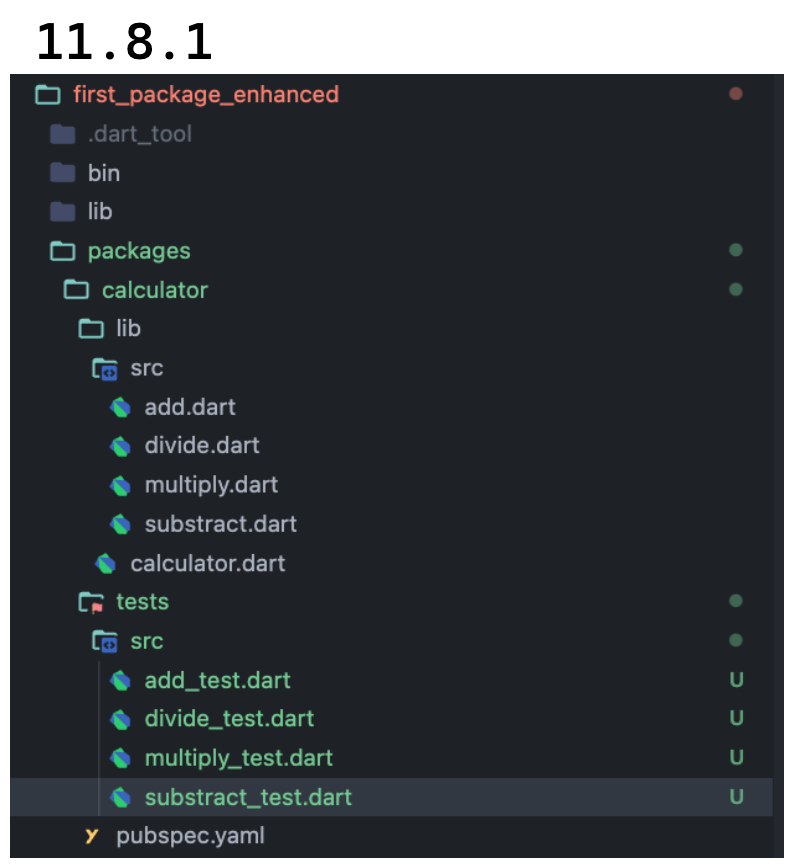
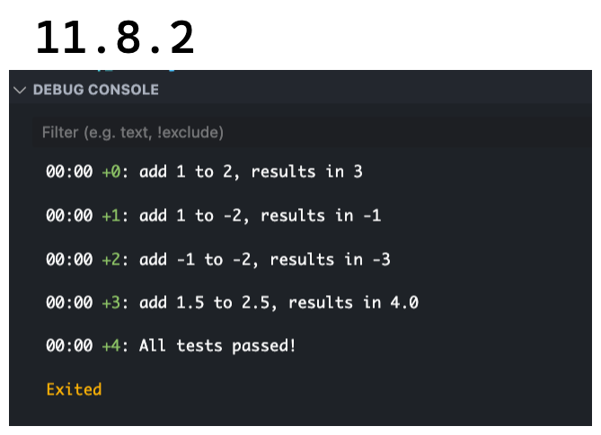
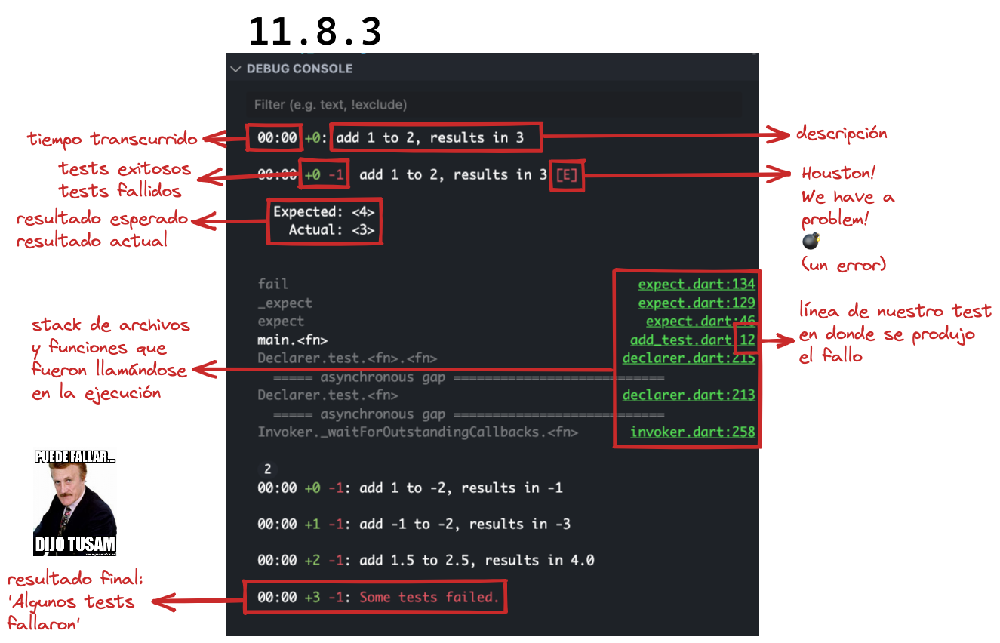

# Dart tests, introducción

Ahora que ya tienen una muy buena base para entender cómo esto va funcionando,
abramos el paquete `calculator` que creamos (ya no dije proyecto! 🥳) y vamos a
pensar un poquito en él y hacernos algunas preguntas:

- Qué pasaría si a la función de suma (`add`) le pasamos un número negativo?
- Y si hacemos eso con cada una de las otras funciones?
- Qué pasaría si intentamos dividir un número por 0? Y si dividimos 0 por
  cualquier otro número?
- Qué pasaría si algún otro desarrollador quiere subir algo a nuestro paquete.
  Cómo se asegura que no va a estar rompiendo nada de lo que ya está hecho? O
  inclusive nosotros mismos!

Entiendo que parecen preguntas muy sencillas pero __trasladen esto a un programa
mucho más complejo: cómo se asegurarían ustedes que está haciendo lo que debe
hacer? Tendríamos que manualmente emular todos los casos de uso__ de aquello que
estamos creando para ver que no falle y es empezaría a poner más complejo a
medida que agreguemos funcionalidad, lo que haría la tarea super larga y en
algún punto, absolutamente irrealizable.

Por ello existen los tests.

En cuestión de segundos podemos testear toda nuestra aplicación y asegurarnos
que cada pieza de código nueva que metamos, no va a romper lo que ya está
escrito. Y ustedes se preguntarán toda la aplicación no es un poco demasiado? 🤣
Se acuerdan que yo les insisto con los tests desde que empezaron aunque recién
ahora en el capítulo 11 empezamos a ver específicamente qué son? __Si nos
acostumbramos a escribir nuestro código y testearlo al instante o, dependiendo
que _approach_ o enfoque elijan, a escribir los tests y luego ipmlementar el
código, en todo momento, toda su aplicación va estar testeada!__

Por ello, de ahora en más, todo lo que hagamos y hagan, incluirá tests! 🥳 x 1000!

Vamos a encontrar diferentes tipos de tests en Dart! Empecemos con los que más
vamos a estar escribiendo!

## _Unit tests_ o tests unitarios

Un test unitario básicamente __inicializa una pequeña parte de nuestro programa
y testea su comportamiento__. Recuerdan que varias veces les mencioné que cada
pieza de código, función, variable, debe tener una y sola una necesidad por la
cual se creó? Un sólo propósito? Si nosotros hicimos eso a lo largo de nuestro
código, estos _unit tests_ van a tomar cada una de esas partecitas y chequear
que funcionen como esperamos.

Cómo los armamos? Basándonos en la triple A!

1. _Arrange_: arreglar, inicializarlo, preparamos todo
2. _Act_: actuar, ejecutar específicamente lo que queremos
3. _Assert_: afirmar, observar el resultado esperado

Estos tests unitarios deberían ser:

- Simples: una sola función, un solo propósito.
- Fáciles de leer: como si fuera una historia pero muuuuuy resumida, con
  principio (_arrange_), conflicto (_act_) y desenlace (_assert_).
- Confiable: ...medio obvio no? Sino para que escribimos tests!
- Independiente: deben funcionar en cualquier orden, no dependiendo de otros
  tests o servicios, como el estar conectado a internet.
- Rápidos: si están escribiendo uno que demora, hay algo que no está bien
  escrito.

## Manos a la obra

Qué les parece si escribimos algo bien sencillo en donde les pueda mostrar lo
anterior?

Vamos a ir dentro del _package_ `calculator` y como verán, no tiene una carpeta
`tests`. Vamos a crearla en el directorio raíz, a la altura de `/lib` y luego
crear un test para cada una de las funciones que queremos testear. Para que los
tests sean reconocidos por Dart, su nombre tiene que terminar en `_test.dart` y
para mantener el orden, copiamos el _path_ o ubicación del archivo que queremos
testear de nuestra librería (que se encuentra `/lib`), en el directorio de
tests. Veríamos algo así:



Vamos a ir al primero de ellos, el `add_test.dart`.

Para poder crear un test unitario que __inicialice una pequeña parte de nuestro
programa__, tenemos que entonces agregar un `main() {}` en donde escribiremos el
test; cuando lo hagan, van a ver enseguida que encima de dicho `main` les
aparecen los comandos para correrlo en VSCode.

Una vez allí, vamos a introducir la __estructura básica de un test unitario__:
`test('...aquí vendrá la descripción...', () {})`. Y observen que cuando
escriban la palabra test que vendría a ser una función, no se las va a reconocer
y van a tener que importar el paquete de tests:

```dart
import 'package:test/test.dart';

main() {
  test('', (){});
}
```

En la __descripción__ , tenemos que responder a la pregunta específica de qué
hace este test. Vamos a hacer un ejemplo de prueba que sin relacionarlo aún con
la función `add` que queremos testar para que entiendan y puedan ver claramente
la estructura.

Como vamos a arrancar con un ejemplo muy sencillo, sencilla será
la descripción:

```dart
main() {
  test('afirma que `a` de valor 1, resulta en 2 cuando se le agrega 1', () {});
}
```

Ya con esto podemos ver qué queremos hacer verdad? Paso siguiente, vamos a
escribir comentarios para dejar en claro cada una de las etapas de nuestro test,
obviamente dentro de las llaves o función anónima que va a ser llamada cuando se
ejecute la función `test`. Y aquí __déjenme hacer un paréntesis para recordarles
qué era un _Callback_: es una función que va a ser pasada como parámetro para
luego ser ejecutada por la función que recibe dicho parámetro.__

Más simple: `test` es una función. El primer parámetro (pueden ver esto si se paran encima) es la _description_, es un `dynamic` que nos permite explicar qué va a hacer nuestro test. El segundo parámetro es el _body_ o cuerpo, (`dynamic
Function()body`) y refiere a una función que puede devolver cualquier valor pero
que va a ejecutarse en algún momento dentro de `test`.

Dicho lo anterior, vamos a poner comentarios para separar las etapas en la que
el test va a desarrollarse:

```dart
import 'package:test/test.dart';

main() {
  test('afirma que `a` de valor 1, resulta en 2 cuando se le agrega 1', () {
    // Arrange

    // Act

    // Assert
  });
}
```

Qué vamos a hacer en __arrange__? En la _description_, aparece una variable
llamada `a` que contiene 1 como valor. Empecemos por eso:

```dart
import 'package:test/test.dart';

main() {
  test('afirma que `a` de valor 1, resulta en 2 cuando se le agrega 1', () {
    // Arrange
    const a = 1;
    // Act

    // Assert
  });
}
```

Luego en __act__ qué haríamos? Qué está sucediendo acá? Porque hasta ahora solo
presentamos el personaje de la historia pero no hizo nada! 🤓 Vamos a hacer que
alguna criatura mágica agregue 1 a la variable `a`:

```dart
import 'package:test/test.dart';

main() {
  test('afirma que `a` de valor 1, resulta en 2 cuando se le agrega 1', () {
    // Arrange
    const a = 1;
    // Act
    var result = a + 1;
    // Assert
  });
}
```

Genial! Ya tenemos un `result` de ese acto! Qué haremos entonces en __assert__?
Vamos a afirmar, esperar, que dicho resultado equivalga al valor 2. Cómo lo
hacemos? Con una función que no vimos hasta ahora y será la santa madre de todos
los tests, la función `expect`:

```dart
import 'package:test/test.dart';

main() {
  test('afirma que `a` de valor 1, resulta en 2 cuando se le agrega 1', () {
    // Arrange
    const a = 1;
    // Act
    var result = a + 1;
    // Assert
    expect(result, 2);
  });
}
```

Fíjense que aun no les expliqué que es el `expect` pero díganme si __no es bien
clarito?__ Acá me tomé el atrevimiento de escribirles la descripción en español
porque quería que fuera un ejemplo muy sencillo pero recuerden que todo el
código debe estar escrito en inglés por un estándar de industria.

El __`expect` es otra función del paquete test que si se paran arriba y se
concentran en lo que necesitamos por ahora (práctica que quiero que hagan muy
seguido para poder entender la construcción de las cosas que utilizamos), van a
ver que recibe dos parámetros fundamentales: `actual` y `matcher`.__ Ambos, son
dinámicos por lo que le podríamos pasar lo siguiente y varias cosas más:

- _Variables_: `expect(a,b)`.
- _Literals_: `expect(1,1)` o `expect('Mau', 'Mau')` o `expect([], [])`.
- _Functions_: `expect(result, equals(2))`.

En nuestro caso, lo podemos entender fácilmente: esperamos que el resultado
(`result`), sea 2. Díganme si no es simple al dividirlo en pedacitos pequeños y
hermoso a la vez! 😍

Y qué pasa si se quieren asegurar de los pasos que van realizando a medida que
ejecutan el test? Así es! Lo pueden correr en modo `debug`; una verdadera
delicia! 🤤

Vamos entonces ahora, a testear lo que nos compete: vamos a testear nuestro
paquete `calculator`.

### Testeando la calculadora

Empecemos en el test en el que estamos, borremos el contenido de cada una de las
etapas pero dejemos los comentarios para acostumbrarnos a dividirlas y vaciemos
la descripción

```dart
import 'package:test/test.dart';

main() {
  test('', () {
    // Arrange
    // Act
    // Assert
  });
}
```

Deberíamos utilizar cada uno de nuestros tests, como un __caso de uso__ (_use
case_). Un caso de uso es __una las formas en la que la pequeña porción de
código que estamos testeando, se comporta según algo que hagamos.__

Si estamos por ejemplo testeando la función suma, podríamos probar:

- Qué pasa cuando sumamos dos `int` positivos?
- Qué pasa cuando sumamos un `int` positivo y otro negativo?
- Qué pasa cuando sumamos dos `int` negativos?
- Y cuando sumamos `double`?

En el caso de nuestra suma, nuevamente puede parecer bastante obvio, pero ya
van a ver lo útil que resulta entender este procedimiento de determinar casos de
uso ahora que es obvio, para fijar el proceso de test propiamente dicho; en
casos más complejos ya lo tendrán interiorizado y van a poder abocarse a la
complejidad.

Entonces lo que vamos a hacer es __crear un test para cada caso de uso__ y así
el primero podría ser `test('add 1 to 2, results in 3', (){})`. 💀 Vayan a
escribir los otros!

Listo? __Se verían algo así los míos y digo los míos, porque cada vez más nos
adentramos en la tierra de la hermosa diversidad, pudiendo cada uno proponer
distintos ejemplos, cada uno con su belleza y poder; aprendamos de cada uno de
ellos y nos volvamos mejores__ (pequeño manifiesto filtrado 🤣):

```dart
import 'package:test/test.dart';

main() {
  test('add 1 to 2, results in 3', () {
    // Arrange
    // Act
    // Assert
  });
  test('add 1 to -2, results in -1', () {
    // Arrange
    // Act
    // Assert
  });
  test('add -1 to -2, results in -3', () {
    // Arrange
    // Act
    // Assert
  });
  test('add 1.5 to 2.5, results in 4.0', () {
    // Arrange
    // Act
    // Assert
  });
}
```

Ahora bien, voy a utilizar el primero de los tests para ejemplificar el proceso
y luego ustedes pueden ir solitos con el resto de los tests para la suma.

Primero, voy a seguir los pasos. Y quiero señalar aquí es si bien no es
necesario escribir todas las variables, guardar el resultado y al final hacer el
chequeo, que bien podríamos hacerlo más rápido y suscinto en una sola línea y
estar testeando la función, es importante hacer todo el proceso para fijarlo:

```dart
import 'package:calculator/calculator.dart';
import 'package:test/test.dart';

main() {
  test('add 1 to 2, results in 3', () {
    // Arrange
    const a = 1;
    const b = 2;
    // Act
    var result = add(a, b);
    // Assert
    expect(result, 3);
  });
  test('add 1 to -2, results in -1', () {
    // Arrange
    // Act
    // Assert
  });
  test('add -1 to -2, results in -3', () {
    // Arrange
    // Act
    // Assert
  });
  test('add 1.5 to 2.5, results in 4.0', () {
    // Arrange
    // Act
    // Assert
  });
}
```

Si ustedes corren estos tests, verían en su 'DEBUG CONSOLE' en VSCode, lo
siguiente:



Allí pueden ver que todos nuestros tests fueron exitosos, aunque haya varias
cosas que no entienden aun. Pero ustedes me van a decir: 'si solamente
escribimos uno'? Y en realidad lo que hicimos fue a uno de ellos le agregamos el
`expect`; el resto siguen siendo funciones y corren de forma exitosa. Cuándo no
lo hacen? Cuando falla nuestro test? Cuando la función `expect` no produce el
resultado esperado. Por ejemplo:

```dart
import 'package:calculator/calculator.dart';
import 'package:test/test.dart';

main() {
  test('add 1 to 2, results in 3', () {
    // Arrange
    const a = 1;
    const b = 2;
    // Act
    var result = add(a, b);
    // Assert
    expect(result, 4); // 👁️
  });
  test('add 1 to -2, results in -1', () {
    // Arrange
    // Act
    // Assert
  });
  test('add -1 to -2, results in -3', () {
    // Arrange
    // Act
    // Assert
  });
  test('add 1.5 to 2.5, results in 4.0', () {
    // Arrange
    // Act
    // Assert
  });
}
```

Aquí lo estamos haciendo fallar para que podamos ver cómo se entiende un fallo:



Ahora sí ya tenemos todos los elementos para testear oficialmente nuestra
función `add`. 💀 Vayan ustedes y prueben cómo testear cada uno de estos casos,
sin olvidarse de importar nuestra propia función y no una del paquete `math` de
Dart.

...

...

...

Quería asegurarme de que se hayan tomado el tiempo de hacerlo ustedes primero!
🤣

```dart
import 'package:calculator/calculator.dart';
import 'package:test/test.dart';

main() {
  test('add 1 to 2, results in 3', () {
    // Arrange
    const a = 1;
    const b = 2;
    // Act
    var result = add(a, b);
    // Assert
    expect(result, 3);
  });
  test('add 1 to -2, results in -1', () {
    // Arrange
    const a = 1;
    const b = -2;
    // Act
    var result = add(a, b);
    // Assert
    expect(result, -1);
  });
  test('add -1 to -2, results in -3', () {
    // Arrange
    const a = -1;
    const b = -2;
    // Act
    var result = add(a, b);
    // Assert
    expect(result, -3);
  });
  test('add 1.5 to 2.5, results in 4.0', () {
    // Arrange
    const a = 1.5;
    const b = 2.5;
    // Act
    var result = add(a, b);
    // Assert
    expect(result, 4);
  });
}
```

Espectacular! Ya hicieron sus propios tests! Esto es excitante! Quédense que se
vienen cosas más hermosas cada nuevo capítulo!
