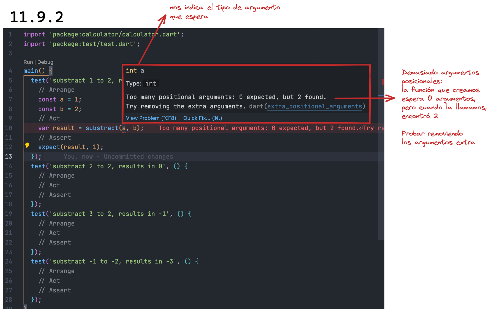
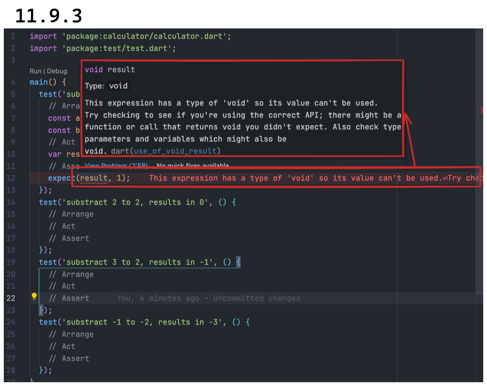

# _Test driven development_

El desarrollo guiado por pruebas o más comúnmente llamado por sus siglas en
inglés _TDD_, se refiere a crear primero el test (generalmente unitario), para
luego escribir nuestro código o bien terminar de escribirlo. Para entenderlo,
vamos a ejemplificarlo.

Vamos a seguir con nuestra amada calculadora pero ahora van a entrar a la
función de resta (`lib/src/substract.dart`)y van a borrar la única línea de
código que tiene, como si nunca hubiera existido.

Paso siguiente, van a ingresar al archivo que creamos para testear esa función
(`test/src/substract_test.dart`) y quiero que escriban los casos de uso que una
función de resta podría tener. 💀 Los espero! Tengo toda la madrugada!🤣

Ah, escriban cuatro casos de uso, como hicimos con la suma. Listos? Los míos se
verían así:

```dart
import 'package:test/test.dart';

main() {
  test('substract 1 to 2, results in 1', () {
    // Arrange
    // Act
    // Assert
  });
  test('substract 2 to 2, results in 0', () {
    // Arrange
    // Act
    // Assert
  });
  test('substract 3 to 2, results in -1', () {
    // Arrange
    // Act
    // Assert
  });
  test('substract -1 to -2, results in -3', () {
    // Arrange
    // Act
    // Assert
  });
}
```

Ahora prestemos atención: ustedes borraron la función no hay absolutamente nada
allí. Vamos a crear el test del primer caso y va a empezar a fallar aun sin
ejecutarlo o por lo menos, marcarnos ciertos errores:


Claro! Borramos la función entonces nos dice que `substract` no existe. Vayamos
entonces al archivo y creemos una función llamada `substract` en su forma
mínima, en su forma más simple, recordando que vamos pasito a pasito para
entender el proceso:

```dart
substract() {}
```

Listo! Allí tenemos la función. Qué les parece si la importamos en nuestro test?
Oh! Ya el error no está sobre 'substract' sino ahora en el primero de sus
argumentos:



Cuando creamos el test, obviamente llamamos a la función con argumentos porque
queríamos poder pasarle valores no? Y además esperábamos que esos valores fueran
enteros (`1` y `2` en nuestro test). Como la estamos llamando con argumentos
pero la función no los espera, nos dice que le pasamos demasiados argumentos!
Que no esperaba ninguno! 🤣

Vamos a entonces agregarle la posibilidad de que reciba argumentos y
específicamente del tipo que queremos:

```dart
substract(int a, int b) {}
```

Y ahora sí, finalmente, deja de producir esos molestos errores! Vamos a
correrla! Y ahora como ustedes ya saben cómo leer un test que falla, me voy a
concentrar en lo que esperábamos y lo que sucedió:

```shell
  Expected: <1>
    Actual: <null>
```

Esperaba `1` pero el resultado fue `null`. Por qué? Porque no estamos retornando
nada de nuestra función, lo que sería lo mismo a escribirla de la siguiente
manera:

```dart
void substract(int a, int b) {}
```

Eso sería una función sin retorno; que solamente hace algo pero no devuelve
ningún valor. Pero si hacemos eso, nuestro test vuelve a fallar:



Fíjense que si nos paramos encime del error (el recuadro inferior), nos expande
la explicación (recuadro superior) y allí dice que la expresión es del tipo
`void`, que no podemos usar ese velor. Y luego nos dice que nos fijemos si
estamos utilizando la interface (API) apropiada o finalmente fíjense si los
parámetros están bien.

Ahora, díganme hasta acá si este no es mejor compañero que
[ChatGPT?](https://openai.com/blog/chatgpt/) 😂 __Si lo aprendemos a utilizar de
forma correcta, nos acompaña todo el camino y va señalando lo que tenemos que
hacer.__ Y es entendible que el proceso les parezca super lento, pero a medida que
lo van entrenando es súper poderoso porque la posibilidad de errores disminuye
al mínimo y con ello, la posibilidad de tener que volver atrás en una tarea que
les llevó mucho tiempo y tiempo de otros involucrados en el proceso. Y __aquí
quiero hacer una salvedad muy importante: hasta el momento, en salvo una de las
compañías que trabajé, logramos luego de mucho insistir, que este sea el modo de
trabajo por defecto.__ Sin embargo, es entendible que no suceda usualmente ya
que los tiempos en esta industria vuelan y aun parecemos no entender que a veces
ir despacio al comienzo, nos permite acelerar gradualmente para correr en el
mediano plazo__.
