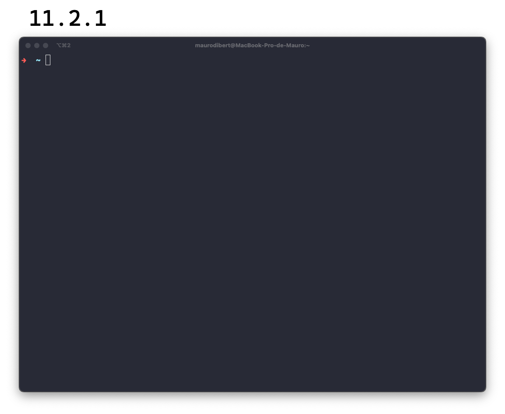
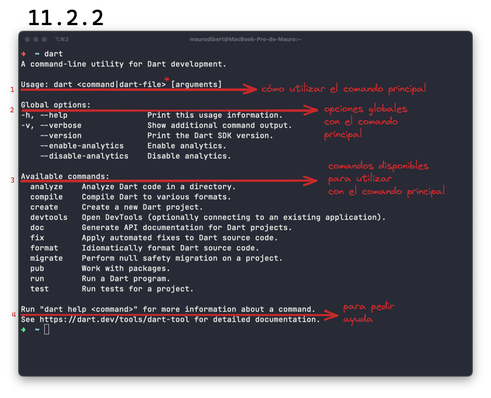

# Crear proyectos Dart

Hemos visto muy superficialmente cómo crear un proyecto desde VSCode. O para ser más honestos, hemos visto cómo crear algunos archivos `.dart` mas no un proyecto. Vamos a hacerlo ahora mismo.

## Desde la terminal

Antes de que presionen media tecla en su terminal, es un buen momento para contarle un poco más de ella, nos amiguemos y la utilicemos más gradualmente.

Estamos acostumbrados a manejarnos con __menúes, ventanas y mouse__, lo que sería propiamente definido, la __interfaz gráfica__. Sin embargo, __existe una ventanita en la que podemos dar instrucciones a casi cualquier programa solamente utilizando una línea de texto simple__ u orden. La terminal o interface de línea de comandos (_CLI, command line interface_) es ese método.

Para acceder a ella, pueden presionar `cmd + t` o `ctrl + t` o bien buscarla según su sistema operativo.

__Lo primero que van a ver, es el _prompt_ o prontuario__ en español y es la ayuda visual que espera le introduzcamos un comando. En mi terminal que está un poco toqueteada y mínima (😂), van a ver esto simplemente: `-> ~ |` pero esto varía de terminal a terminal:

Hace unos párrafos, mencionamos que uno le ingresa órdenes a la terminal. Como sucede con cualquier lenguaje __estas órdenes tienen que estar en orden__ porque sino la terminal como sucedería con otras personas, no entenderían nada. En una __orden tipo__ la primera palabra indica la orden a ser ejecutada y las palabras restantes se pasan como opciones o parámetros y argumentos de la orden: `-> ~ orden [ opciones ] [ arguments ]`

__Las opciones son diferentes posibilidades de usar el comando y las podemos ingresar utilizando `--` antes de la opción, o un solo `-` antes de la abreviatura__ de la opción, que puede ser la primer letra o las primeras dos. Por ejemplo tenemos el comando `dart`, que vendría ser una utilidad en la terminal para desarrollar en Dart. Si solo tecleamos `dart`, esto es lo que nos aparece:

1. Nos cuenta cómo utilizar `dart`: primero el comando `dart`, luego un espacio y otro comando, archivo (y yo voy a agregar ahí mismo donde ven el '*') una opción global para luego otro espacio y argumentos si los hubiere.
2. Las mencionada opciones globales en las que pueden pedir ayuda por un comando ya sea el principal (`dart --version`) o un subcomando (`dart analyze --help`).
3. Los comandos disponibles.
4. Cómo pedir ayuda de una forma distinta, ya no `dart analyze --help` sino `dart help analyze`.

Noten que el espacio aquí importa mucho! Si queremos por ejemplo crear un directorio utilizaríamos el comando `mkdir` seguido del nombre del directorio pero cómo crearían un directorio llamado así 'directorio extra'? Si lo escriben con espacios (`mkdir directorio extra`) va a crearles dos directorios, uno llamado 'directorio' y el otro llamado 'extra'.

Para lograrlo deberían rodearlo de comillas simples o dobles: `mkdir 'directorio extra'`. Y ya que están creando un montón de directorios, para borrarlos pueden utilizar `rm -R [nombre_del_directorio]`. Y por qué la opción `-R`? 💀 Pueden investigarlo ustedes mismos utilizando el comando `man [comando]`, que les va a traer el manual de dicho comando! Para salir del manual, pueden presionar la tecla `q`.

Buscaron!? Lo que hace la `-R` es hacer recursiva la eliminación ya se trata de un directorio que puede contener más archivos o directorios.

Ingresen a su terminal (preferiblemente fuera de VSCode) y escriban `dart --help`. Ese comando (al igual que su abreviación `dart -h`) se compone de dos partes:
