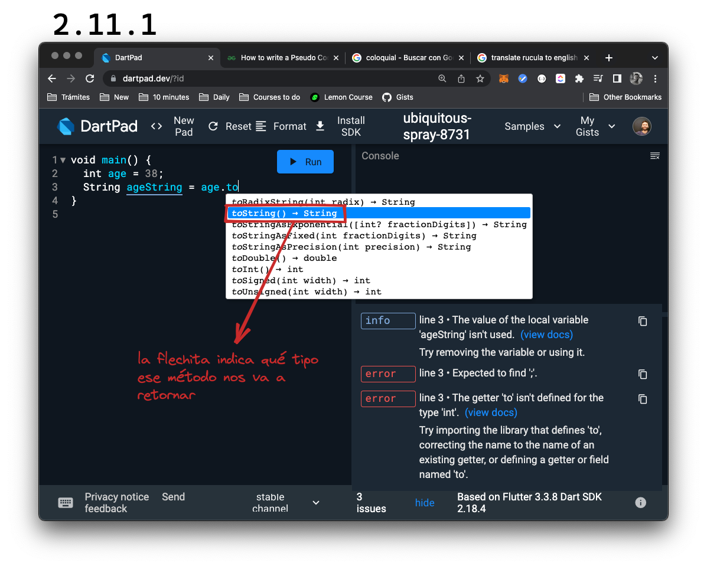

# Conversiones entre tipos

Supongamos que queremos asignar un tipo `int` a una caja del tipo `String`. Podríamos hacerlo así?

```dart
void main() {
    int age = 38;
    String ageString = age;
}
```

Exacto! No! Ya que no podemos asignar un valor del tipo `int` a uno del tipo `String`. Para ello, debemos convertirlo con un método propio. Fíjense qué cosas interesantes podemos descubrir en _Dartpad_ cuando completamos '.to' y leemos los métodos que nos sugiere:



Ahora que sabemos que el método `toString` nos retornará un `String` podemos utilizarlo para la conversión:

```dart
void main() {
    int age = 38;
    String ageString = age.toString();
}
```

Con el mismo procedimiento, podríamos convertir un `double` en un `String`. Sin embargo, vamos a utilizar otro método ahora y quiero que descubran qué es lo que hace. Para ello les voy a poner tres ejemplos:

```dart
void main() {
    double height = 1.56;
    String heightToString = height.toStringAsFixed(1);
    print(heightToString);
}
```

```dart
void main() {
    double height = 1.55;
    String heightToString = height.toStringAsFixed(1);
    print(heightToString);
}
```

```dart
void main() {
    double height = 1.54;
    String heightToString = height.toStringAsFixed(1);
    print(heightToString);
}
```

💀 Espero que se hayan tomado su tiempo o recapaciten y lo hagan en este mismísimo momento! 🤣 El método `toStringAsFixed` convierte un `double` en un `String` pero nos permite elegir cuántos decimales utilizamos y acerca los decimales restantes.

Ahora supongamos que queremos hacer el camino inverso: convertir un `String` en un `double`. Vamos a tener que cambiar un poquito la sintáxis:

```dart
void main() {
    String hotelRatingString = '4.5';
    double hotelRating = double.parse(hotelRatingString);
    print(hotelRating);
}
```

Porqué debemos utilizar esta otra sintáxis? Porque no todas las cadenas de texto o `String` pueden convertirse en `double` y el método `parse` intenta descifrarlo y si no lo logra, aborta la execución lanzando o retornando una _Exception_ del tipo _FormatException_ que nos dice en este caso: _'Uncaught Error: FormatException: Invalid double Excellent hotel!'_.

```dart
void main() {
    String hotelReview = 'Excellent hotel!';
    double hotelReviewDouble = double.parse(hotelReview);
    print(hotelReviewDouble);
}
```

Finalmente podemos convertir desde `int` a `double` o viceversa pero teniendo en cuenta:

- De una variable que contiene un `int` a un `double` debemos utilizar el método `toDouble` ya que no tenemos conversión directa y pueden probarlo así 💀:

```dart
void main() {
    int x = 10;
    double y = x; // en rojo van a ver un error:
                  // un valor del tipo `int` no puede
                  // asignarse a un valor del tipo `double`
}
```

```dart
void main() {
    int x = 10;
    double y = x.toDouble(); // ahora sí! 💪
}
```

- De un `int` literal a un `double`, podemos hacerlo directamente ya que Dart __promueve__ dicho `int` a `double`:

```dart
void main() {
    int x = 10;
    double y = 20; // double promotion 👆
}
```

- De un `double` a un `int`, deberemos escoger un método para decidir qué hacer con los decimales. Les propongo experimenten y aprendan. Aquí les muestro uno:

```dart
void main() {
    int x = 10;
    int y = 20.6.round(); // 21 (redondeo ⭕️)
}
```


