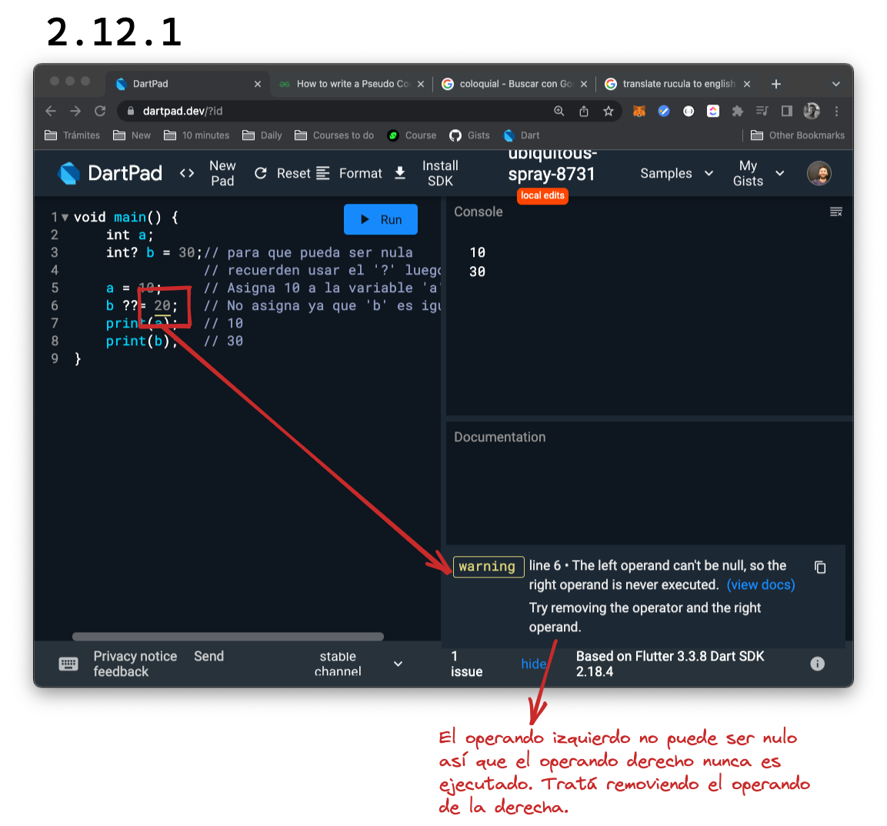

# Operaciones aritméticas o _arithmetic operations_

Son las operaciones más conocidas a las que les sumamos un par que no utilizamos tan seguido:

|Operación|Símbolo|💀 Pruébenlo!|
|---------|:-----:|:-----------:|
|Suma|__+__|`print(5+2)`|
|Resta|__-__|`print(5-2)`|
|Multiplicación|__*__|`print(5*2)`|
|División|__/__|`print(5/2)`|
|División de enteros|__~/__|`print(5~/2)`|
|Módulo|__%__|`print(5%2)`|

## Operadores de asignación o _assignment operators_

Como ya vieron, pueden asignar un valor utilizando el _assignment operator_, '='. Ahora vamos a sumar el '??=' _operator_, que nos sirve para asignar un valor solo si la variable a la que se lo intentamos asignar está vacía, sino dicha variable mantiene su valor. Veámoslo:

```dart
void main() {
    int a;
    int? b;   // para que pueda ser nula
              // recuerden usar el '?' luego del tipo
    a = 10;   // Asigna 10 a la variable 'a'
    b ??= 20; // Asigna 20 dado que 'b' está vacía
    print(a); // 10
    print(b); // 20
}
```

```dart
void main() {
    int a;
    int? b = 30;// para que pueda ser nula
                // recuerden usar el '?' luego del tipo
    a = 10;     // Asigna 10 a la variable 'a'
    b ??= 20;   // No asigna ya que 'b' es igual a 30
    print(a);   // 10
    print(b);   // 30
}
```

Sin embargo, en este último caso, descubrimos un subrayado nuevo a los anteriores (rojos y azules), el subrayado amarillo: nos advierte mediante una advertencia, que el valor no puede ser nulo:



### Mezclando lo anterior con _compound assignment operators_

Si quisiéramos asignar a una variable el resultado de sumar esa misma variable con otra, probablemente haríamos algo así:

```dart
void main() {
    int a = 5;
    a = a + 3;
    print(a); // 8
}
```

Sin embargo, tenemos una forma más acotada de escribir lo mismo y es utilizando los operadores de asignación compuestos:

```dart
void main() {
    int a = 5;
    a += 3;
    print(a); // 8
}
```

Obtenemos el mismo resultado pero con algunos caracteres menos. Y pueden aplicar todas las operaciones anteriores solo teniendo en cuenta utilizar un `double` si lo utilizamos para dividirm ya que un valor del tipo `double` (el que va a retornar la división) no puede ser asignado a uno del tipo `int`:

```dart
void main() {
    int a = 5;
    a /= 3;   // deberían ver un subrayado rojo
    print(a); // debajo del 3 😒
}
```

## Precedencia de operadores u _operators precedence_

Es el orden en el que los operadores van a ser ejecutados. Cuál les parece que va a ser el resultado de imprimir `print(10 - 2 * 5);`? 💀 Pongan a prueba su pasado matemático! 🤣

El resultado es '0' ya que el operador '\*' tiene precendencia sobre el operador '-'. Esto quiere decir que primero se ejecuta la operación que contiene '\*' (la multiplicación) y luego la resta. Sucedería lo mismo con la división y la suma:

```dart
void main() {
    print(10 + 10 / 2); // 15
}
```

__Si quisiéramos alterar el orden__ en el que se ejecutan, __podemos utilizar '( )'__, obligando a Dart a ejecutar primero lo que queremos__:

```dart
void main() {
    print((10 + 10) / 2); // 10
}
```

## 💪 De _Feet_ (Pie) a Cm

__Requirement__:

1. Escriban un programa que les permita poner su altura en cm y les retorne cuánto equivaldría esa medida en pies o _feet_.

2. El resultado tiene que expresarse con dos decimales.

```dart
void main() {
    // Basic formula: 1 f = 30.48 cm
}
```

__💀 Solución__:

```dart
void main() {
    // Basic formula: 1 f = 30.48 cm
    double myHeightInCm = 165;
    double oneFeetInCm = 30.48;
    String myHeightInFeet = (myHeightInCm / oneFeetInCm).toStringAsFixed(2);
    print('My height in feet is: $myHeightInFeet f.');
}
```
