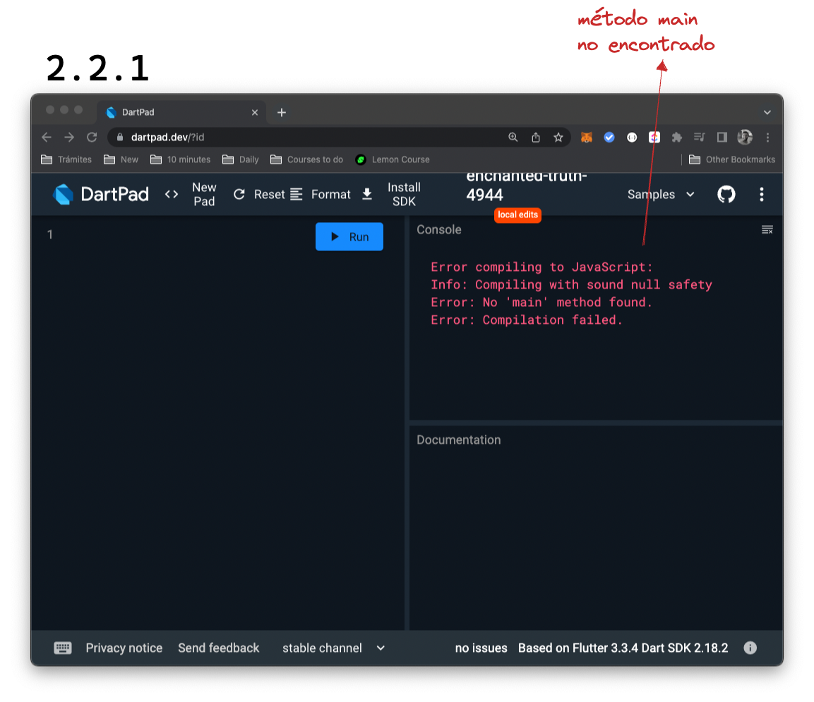
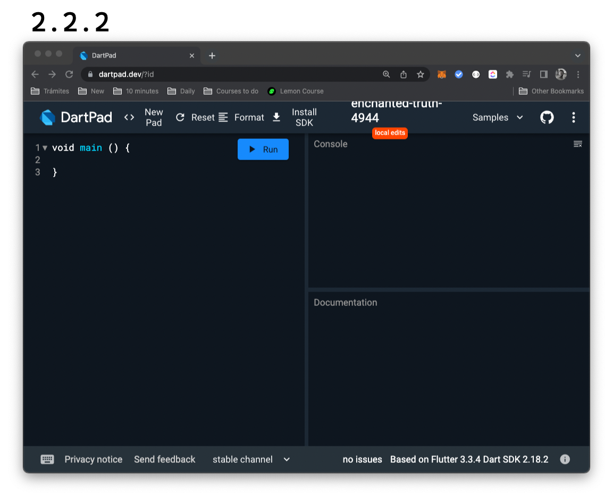

# El método _main_

@Mau Di Bert

Un programa de Dart es válido solamente si contiene un método main. Sino, prueben borrar todo y ver lo que aparece en consola. Probaron? 😒 ... 😏 ... 🧐:



El método main es __también llamado _entry point_ o punto de entrada__ de nuestro programa y es el que va a recibir todo nuestro código.

Prueben ahora crearlo de la siguiente manera agregando las siguientes líneas de código:

``` dart
void main() {

}
```

Ah! Y qué es ese bloque de texto que aparece con colores? En lugar ahora de mostrarles una imagen, les mostramos este __bloque de código__: pueden copiarlo y pegarlo fácilmente aunque ya saben que eso no les va a enseñar nada 🥸: para aprender tienen que escribir ustedes mismos cada letra de cada código. Sin embargo, les queríamos mostrar esto porque a futuro, si ustedes suben código para que alguien más lo vea, por ejemplo en algún ejercicio o en su trabajo, es recomendable hacerlo así para que quien pruebe su código, pueda correrlo fácilmente solo mediante copiar y pegar. Sino, imagínense que quien quiera ayudarlos tiene que copiar miles de líneas además de encontrar cómo darles una mano! 🤣



## TDD o nuestra forma particular de enseñarnos

Vieron lo que hicimos? 

1. Corrimos el programa sin haber escrito un _main method_.
2. eso lo _rompió_ y 
3. lo _arreglamos_ escribiendo un código nuevo, el _main method_.

__Esto se llama _TDD_ o _Test Driven Design_, escribir código desde los tests.__

Si bien no es que vamos a usar este método todo el tiempo, __el hacer _tests_ de aquello que escribimos es una ayuda invaluable__: cada test funciona como un pequeño robot que va a chequear que todo funciona como esperamos sin tener nosotros que manualmente correr la aplicación entera, ir hasta el lugar para hacer esa cosa que debería hacer, esa otra y finalmente, la otra! 🕺🏻 __En cuestión de segundos podemos correr miles de pruebas que nos llevarían días o semanas de probar manualmente__ y asegurarnos que cada pieza nueva que escribamos, va a encajar con el resto.

Esto es un __estándar en la industria__ cuando queremos llegar a trabajar para el primer nivel y __aprenderlo desde el comienzo__, va a hacer que sea muy natural para vos hacerlo luego, sin esfuerzos extras! 💪
