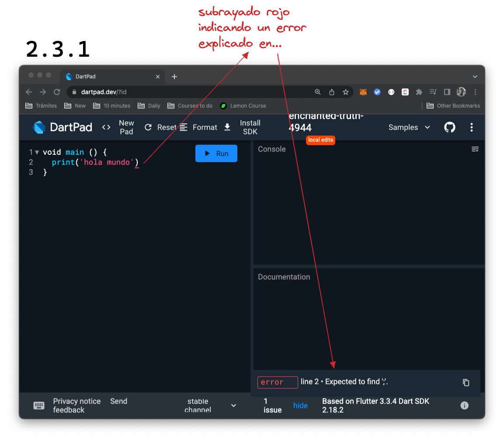
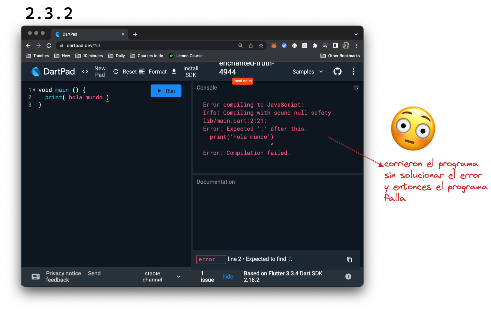
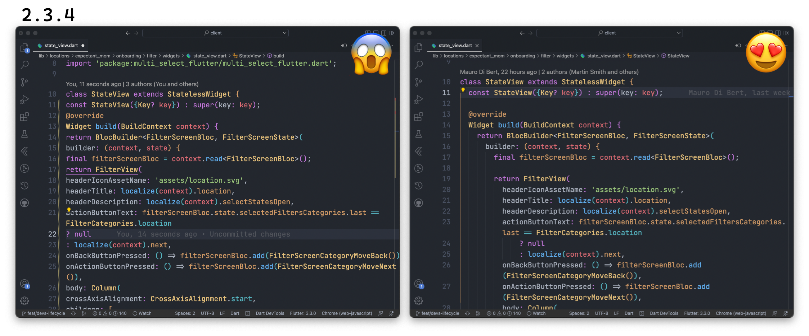
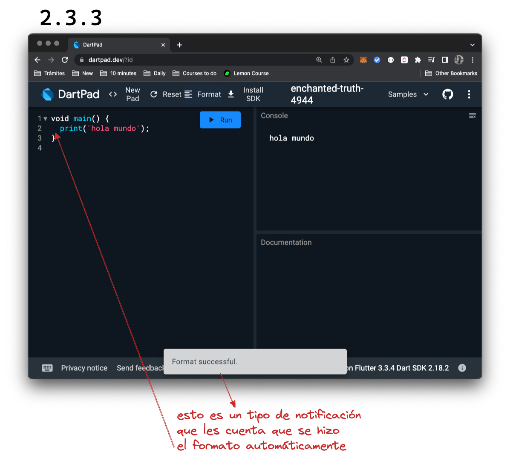

# Nuestro primer programa

Como les contamos en el artículo anterior, queremos que aprendan a crear __tests primero__ que nada, ejecuten el programa, el programa se rompa y sepan qué código tienen que escribir.

## Requerimientos?

Como ahora estamos __utilizando _Dartpad_, no contamos con herramientas específicas de testing__ y por ello, vamos a ir cambiando las formas en las que creamos nuestros tests.

Vamos a crear una serie de reglas llamadas __requerimientos o _requirements_: es lo que queremos que nuestro programa haga__. Vamos a obviar aquí los tests o marcado de errores que ya el mismo lenguaje utiliza. Por ejemplo, si no escribimos el _main method_, sin que escribamos ningún test, el lenguaje nos marca automáticamente el error; esto sucederá en muchos otros casos y es una enorme ayuda cuando escribamos cientos de líneas de código.

## Hello world u hola mundo

Es el programa más sencillo de todos y es casi una _convention_ o convención empezar con él: imprimir en pantalla "Hola mundo!" y he allí nuestro requerimiento primero:

__Requirement__: imprimir en pantalla "Hola mundo".

Para ello, vamos a escribir las siguientes líneas de código:

```dart
void main() {
    print('hola mundo')
}
```

Qué pudieron ver en _Dartpad_? Algo así?



Prueben correr el programa sin solucionar el error como _Dartpad_ se los recomienda.



En este caso, pudieron ver que no tuvimos que crear ningún test para asegurarnos de que la línea tiene que estar escrita de cierta manera, siguiendo [ciertas reglas](https://dart.dev/guides/language/language-tour)?: Dart lo hace él mismo.

Si ustedes agregan dicha línea y lo corren, deberíamos ver el resultado esperado... verdad? 🤔 Qué imprimió la consola? Cuál era el requerimiento? Mientras piensan esto inconscientemente, les contamos algo más.

## Formato

Si ustedes copiaron el código de la misma forma que yo lo escribí, habrían hecho esto:

1. void main () {}
2. Entraron dentro de los {}
3. Dentro teclearon _enter_

Qué pasó? Si no lo hicieron, borren todo y háganlo de vuelta así pueden notar ustedes mismos qué sucede: Dart cuenta con un sistema que __además de corregir los errores, puede corregir cómo escribimos, el estilo__.

Así, agrega espacios para indicar más claramente que un pedazo de código está dentro de otro pedazo, o colores para diferenciar palabras clave y mucho más.

Prueben también qué sucede si borran esos espacios y lo corren. Pudieron ver que funciona perfectamente salvo que es apenas más difícil de leer? Y ustedes dirán 'son dos espacios, no es más difícil'. Pero compruébenlo ustedes mismos: qué código les parece más fácil y placentero de ver? 🤨



 y luego hacen click en _Format_ y voilà!



## Tests?

Podrían decir que la tarea está terminada? Como dijimos, no tenemos forma de automatizar el proceso de testing sino que tendremos que hacerlo nosotros mismos por ahora. Vuelvan a los _requirements_, revisen su código, luego el _output_ en la consola. Encuentran alguna diferencia? __Logramos exactamente lo que estaba pedido?__

Si no pudieron aun notar la diferencia, busquen un ratito más.

🤔

🤷🏻‍♂️

🤦🏻‍♂️

Ok! El requerimiento decía imprimir "Hola mundo" y el código que escribimos imprime "hola mundo", siendo la primer letra en minúscula cuando debiera ser en mayúscula.

Nuevamente nos encontramos con un caso super simple y pensamos que no genera mucha diferencia pero a veces, en el trabajo cotidiano pensamos de la misma forma dejando de lado lo que la persona que escribió el requerimiento pensó con mucho esfuerzo.

De ser así, lo mejor sería contactarte con esa persona y sugerirle que nuestro código puede solucionar mejor su problema o que no hace mucha falta marcar la diferencia.

__Tratamos de que no solamente aprendan a escribir código de calidad sino también absorvan buenas prácticas__ para con ustedes y sus compañeros y compañeras y tengan la oportunidad de amar esta profesión como nosotros lo hacemos!
