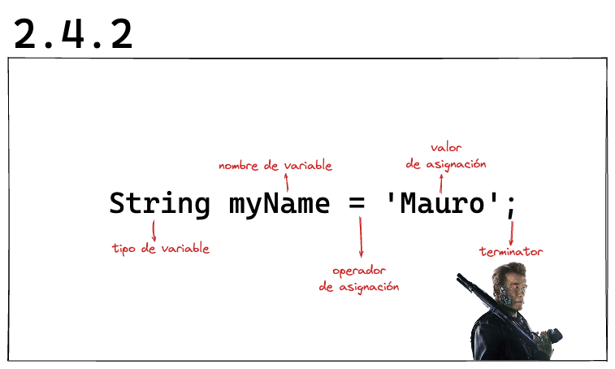
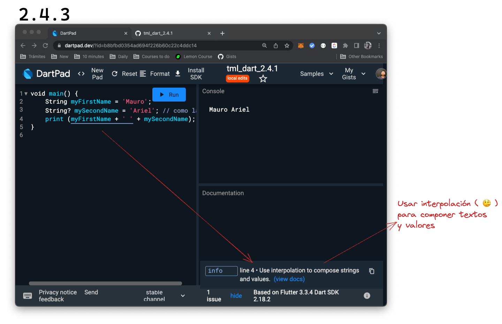

# Variables: declaración e inicialización

@Mau Di Bert

_Variables_ o variables (🤣), son __especie de cajas que nos permiten guardar valores__ dentro. Según aquello que queramos guardar vamos a necesitar tipos de cajas.

Si en nuestro programa quisiéramos __alojar__ nuestro nombre __para luego imprimirlo__, necesitaríamos una de estas variables. Limpien su Dartpad y empecemos!

__Requirement__: guardar nuestro nombre para luego imprimirlo.

```dart
void main() {
    // Ya vimos qué utilizamos en el pasado para imprimir
    // pero no vimos... 🤨 ... esta escritura!
    // Estos son comentarios de código utilizados
    // para hacer aclaraciones, guías u organizarlo.
    // Ya hablaremos más de ellos!

    // Ya conocemos 'print()': imprime algo en pantalla.
    // Qué pasa si escribimos solamente esto?
    // Estaríamos creando nuestro primer test! 😍.
    // Hagámosla fallar y veamos qué nos dice!
    print();
}
```


Ya aprendimos también que una lína de código en _Dart_, tiene que finalizar con ';', por lo que sabemos ese no es el error que nos está mostrando. Pero además de esto, tenemos una explicación bien clara: 'faltan argumentos'. Ya vimos en el pasado que `print('Hola mundo')` mostraba en consola la frase 'Hola mundo'. Cuál les parece entonces que podría ser el siguiente paso para _arreglar_ el test que creamos?

## 💀 Aprendizaje muerto

Lo ideal, es que se tomen un tiempo para resolverlo ustedes solos antes de avanzar. De esa manera, van a hacer las conexiones neuronales necesarias para aprender! Por eso, vamos a introducir esto: 💀. Ese emoji representa la mismísima muerte del aprendizaje! 😵‍💫🙄🤣. __Cada vez que lo vean, saquen los ojos de este artículo y póngase a trabajar duro para resolver el ejercicio__. Pueden poner un cronómetro o _timer_ para determinar cuánto tiempo dedicarle antes de claudicar vilmente! 😂.

Creemos que ha sido suficiente escarmiento, así que podemos continuar!

__Qué es lo que solemos hacer cuando estamos con poco tiempo? Solemos ver parte de aquello que estamos haciendo porque estamos pensando en hacer algo más__. Si hubiéramos querido _intentar resolver_ nuestro problema rápidamente, es probable que hubiéramos hecho algo como esto:

```dart
void main() {
    print('Mauro');
}

```

Liiiiiiisto! Nuestro nombre impreso en pantalla! 🙄 Sin embargo, si nos detenemos unos instantes y leemos nuevamente el _requirement_, qué encontramos? Se los dejo por acá así no tienen que volver a buscarlo:

__Requirement__: guardar nuestro nombre para luego imprimirlo.

Si fuéramos lentamente, podríamos dividir este pedido que nos han hecho, en dos partes: _1: guardar nuestro nombre_ para, _2: luego imprimirlo_. Pero cómo guardamos nuestro nombre? Necesitaríamos una... _especie de caja que nos permita guardar valores_! 🚀. Ha llegado el momento de introducir a las _variables_.

## Declaración de variables

Una de estas cajas, __para ser creada, tiene que ser primero declarada__ y se hace escribiendo el tipo de caja que va a ser y luego el nombre que va a llevar y que represente de la forma más clara posible aquello que queremos poner dentro, pensando siempre en que otra persona en el futuro puede llegar a leerla sin tener mucha idea del proyecto y tratando de que no tenga que razonar demasiado para entender su contenido: `String myName`.

_String_ significa 'cadena' y viene a representar un tipo de caja que almacena una serie de caracteres.
_myName_ es el nombre que elegí para representar precisamente lo que quiero hacer sin ser tan _verbose_ o explicarme demasiado de forma redundante, por ejemplo: `String developerNameOfThisNotAnyDartFromTheBasicsCourse`.

En el nombre podemos utilizar letras, números (siempre y cuando no sea el primer caracter) o _underscore_ ('\_'), salvo caracteres o palabras específicas de _Dart_ que van a ir aprendiendo en el camino. Sin embargo, como sus ojos de detectives programadoriles habrán notado, tienen que escribirse de una forma en particular: _Camel case_.

### camelCase

Cada lenguaje tiene sus espcificidades y esta es una de Dart: salvo la primer letra que debe escribirse en minúscula, cada palabra se diferencia comenzando con una mayúscula. En español sería 'algoComoEsto'.

Tenemos entonces hasta ahora la variable declarada. Será que ya podemos utilizarla?

```dart
void main() {
    String myName;
    print(myName);
}
```

Noup! Tenemos el siguiente error:

_'The non-nullable local variable 'myName' must be assigned before it can be used.'._

En este caso, les copié directamente el mensaje de error porque es más fácil que capturar la pantalla pero lo hice porque ustedes ya saben ver los errores y además, en esta profesión van a ver mucho más código que capturas de pantallas! 😆.

El mensaje dice: 'La variable local _no nulleable_, debe ser asignada antes de ser utilizada'. Bien extraño no? No lo es si respiramos, bajamos la velocidad y lo dividimos en partes más pequeñas para entenderlo:

_la variable local_: significa que está en la pieza de código que estamos escribiendo.
_no nulleable_: que sí o sí tiene que tener un valor; no puede inicializarse vacía.
_debe ser asignada antes de ser utilizada_: le tenemos que proveer un valor, un contenido antes de usarla, la tenemos que _inicializar._

## Inicialización de variables

Inicializar una variable es, __luego de que la variable ha sido declarada, ponerle un valor dentro__. Para hacerlo, utilizamos el siguiente orden, relación de palabras o _sintáxis_:



En este caso, estamos hablando de una caja o _variable_ que almacenará una cadena de caracteres y la adecuada para este tipo de valores es un _String_.

Para crear un valor del tipo _String_, rodeamos dicho valor con comillas simples o _single-quotes_ ('valor'), con comillas dobles o _double-quotes_ ("valor") o si vamos a necesitar hacer líneas múltiples o _multilines_, utilizamos comillas triples o _triple-quotes_ ('''
Este valor
Tiene varias
Líneas'''
).

__La práctica recomendada__ sería utilizar en la mayor cantidad de los casos __single-quotes__.

Ahora bien, ya con todo eso, tendríamos todo lo necesario para completar a la perfección nuestro _requirement_? 💀 Intentalo!

Esperamos que te hayas tomado el tiempo para tratar de hacerlo vos mismo y no hayas sacrificado a tu pobre aprendizaje!

```dart
void main() {
    String myName = 'Mauro';
    print(myName);
}

```

Ahora sí cumplimos con todos los requerimientos necesarios :muscle: :

- [x] Guardar nuestro nombre
- [x] Imprimirlo

### Yendo un poco más allá

Supongamos que en este programa que estamos construyendo queremos guardar además, nuestro segundo nombre, _en caso de que tengamos uno_. Qué pasa con aquellos que no tienen segundo nombre? Cómo va la aplicación a guardar algo que podría no existir o ser... nulo? 😳

#### Null value

Es un __valor utilizado para representar algo que no tiene valor.__
Dicho valor en _Dart_ recibe el nombre de _null_, un tipo especial de valor del que hablaremos bastante y bastantes dolores de cabeza nos vamos ahorrar si aprendemos de él desde el comienzo!

Lo primero que tenemos que hacer es cuando declaramos nuestra caja o _variable_, decirle que puede llegar a contener un valor nulo. Cómo hacemos esto? Simplemente agregando luego de su tipo, el operador de aserción nula o _null assertion operator_ (o bien pobremente llamado, signo de interrogación '?' 😝) de esta manera: `String?` Todo entero quedaría algo como... 💀 Sí! Primero prueben ustedes cómo sería guardar tanto el primer nombre como segundo nombre en sus códigos, previendo que el segundo sea nulo.

```dart
void main() {
    String myFirstName = 'Mauro';
    String? mySecondName = 'Ariel'; 
    print (myFirstName + mySecondName);
}
```

## Concatenation e Interpolation

Bien! Fíjense que introdujimos algo nuevo y es la posibildad de _concatenar_ (proceso llamado _concatenation_) valores de texto con un '+'. Sin embargo, ya pudieron ver que al imprimirlo, ambos nombres quedan encimados. Vamos a hacer un poco más de espacio, introduciendo justamente, un espacio:

```dart
void main() {
    String myFirstName = 'Mauro';
    String? mySecondName = 'Ariel';
    print (myFirstName + ' ' + mySecondName);
}
```

Todo este tiempo estuvieron con ese subrayado azul y pudieron evitarlo sin decirme nada? No es un error sino una sugerencia. En este caso les dice que usen otro mecanismo que suele ser más limpio y claro: _interpolation_:



La interpolación sería el proceso de rodear con _single-quotes_ o _double-quotes_ el texto, introduciendo valores de variables y resultados de cálculos. Va a representar exactamente lo que ustedes escriban incluyendo espacios aunque van a tener que utilizar un $ para llamar a las variables. En este caso sería así:

```dart
void main() {
    String myFirstName = 'Mauro';
    String? mySecondName = 'Ariel';
    print ('$myFirstName $mySecondName');
}
```

Vamos a ver que logramos el mismo resultado aunque con una práctica recomendada por _Dart_ y tenemos un código más limpio!

Ahora bien... cómo llenarían ustedes este código si no tuvieran segundo nombre? 💀 Hagan un intento solitos y solitas!

Si hubieran introducido el valor nulo, habrían tenido una recomendación en la línea 4: No inicialicen variables explícitamente usando el valor nulo. Por qué es esto? Porque _Dart_ lo hace por nosotros. Y valdría solamente con declarar esa variable. El resultado sería algo así:

```dart
void main() {
    String myFirstName = 'Mauro';
    String? mySecondName; // me sacaron el segundo! 
    print ('$myFirstName $mySecondName'); // Imprimiría: Mauro null
}
```

No es tampoco lo esperado verdad? De repente me llamo 'Mauro null'! 🤣 Vamos a cerrar este artículo con algo un poco más avanzado y que va a permitir que si el segundo nombre es nulo, entonces no lo imprima!

Este código tiene __dos partes nuevas: {} y '??'__. Los __{}__ nos permiten elaborar alguna operación en la que podemos si queremos, llamar a una variable dentro de una _interpolation_. Por otro lado el __'??'__ es uno de los _null aware operators_ u operadores para trabajar valores nulos y nos permite devolver otra cosa si el valor que nosotros estamos llamando, es nulo. En este caso, si `mySecondName` es nulo, devolvemos una _String_ vacía, representada así: ''.

```dart
void main() {
    String myFirstName = 'Mauro';
    String? mySecondName; // Ahora soy millenial!
    print ('$myFirstName ${mySecondName??''}');
}
```

La última aclaración que les hago es que los __{ }__ dentro de una _interpolation_, sirven también en casos en los que tenemos que mostrar una variable junto (sin espacio mediante) a algún sufijo o prefijo. Por ejemplo, queriendo expresar el valor de una temperatura y su unidad de medición:

```dart
void main() {
    double temp = 24.5;
    print ('${temp}C');
}
```
