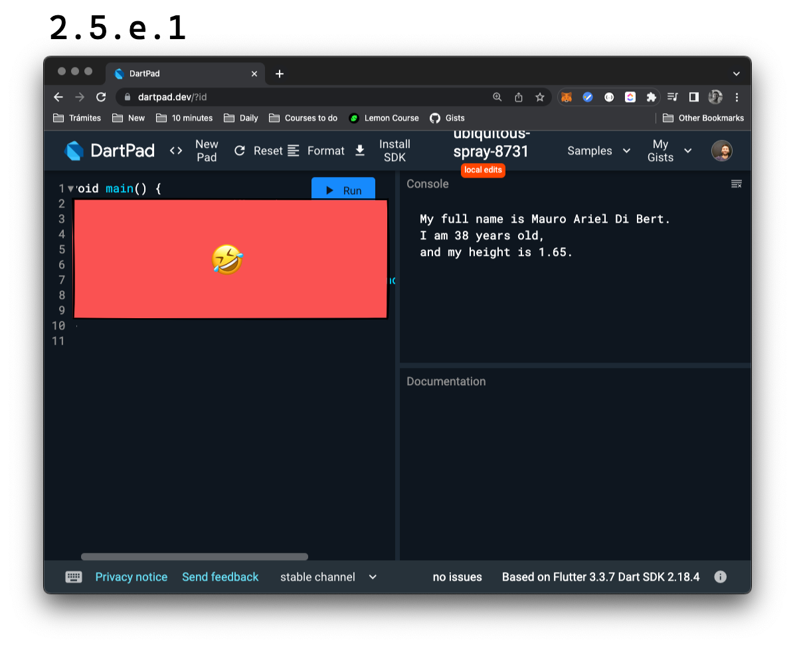

# Ejercicio: a imprimir variables

Vamos a ir alternando con algunas ejercitaciones. Recuerden que si quieren más ejercicios, un lugar donde consultar dudas o conocerse con nosotros y otros fanáticos del código, pueden [sumarse a nuestra comunidad gratuita en Discord]()!

Cada ejercicio se va a componer de un _requirement_ y una o varias soluciones propuestas para resolverlo. Algunas veces, podremos introducir los pasos que llevamos para lograrlas. Sin embargo, recuerden siempre seguir el método propuesto de:

1. Leer qué es lo que se requiere lentamente. Si puede dividirse, hacerlo en partes más pequeñas, o _sub-requirements_.
2. Crear el código de fin a principio, como un test para ir recibiendo la ayuda de Dart para arreglarlo.
3. Proponer una solución final y chequear nuevamente para ver si los _requirements_ fueron satisfechos de forma correcta.

__Requirement__: almacenar variables para luego imprimirlas de forma tal que la consola muestre algo como la siguiente imagen y que utilicen para componer el nombre completo, una variable para el primer nombre, una variable para el segundo (si lo tuvieran) y una variable para el apellido; utilicen sus propios nombres y datos:



__💀 Solución__:

```dart
void main() {
  String myFirstName = 'Mauro';
  String mySecondName = 'Ariel';
  String myLastName = 'Di Bert';
  int myAge = 38;
  double myHeight = 1.65;
  print('My full name is $myFirstName $mySecondName $myLastName.');
  print('I am $myAge years old,');
  print('and my height is $myHeight.');
}
```
