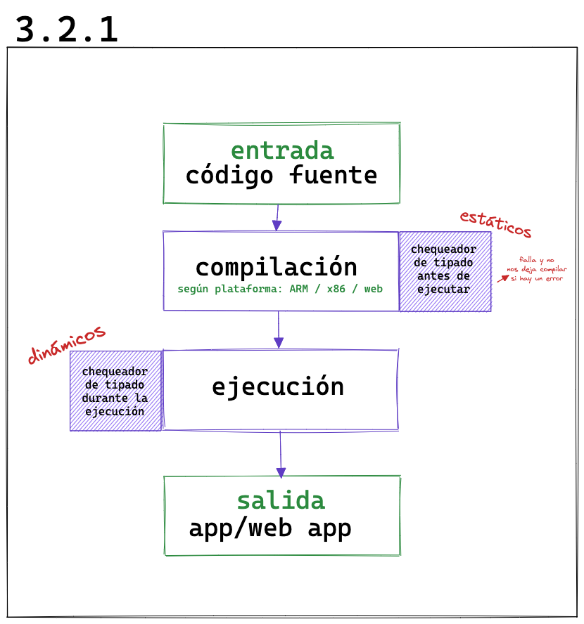
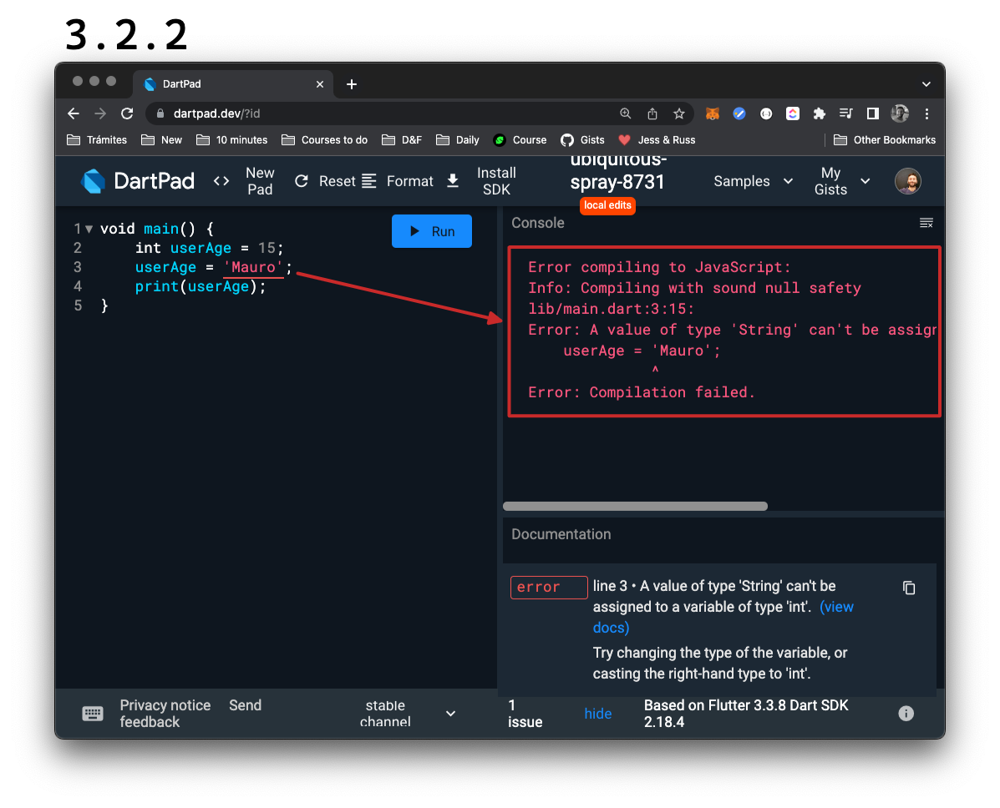

# Lenguajes estáticos y dinámicos

Para entender qué diferencia hay entre uno y otro, vamos a ver qué sucede cuando escribimos un código:

__Lo primero__ que hacemos es introducir un __código fuente o _source code_;__ sería lo que por ejemplo nosotros hacemos cuando escribimos `main(){...aquí...}`

Eso __luego, debe ser compilado__ según el tipo de procesador o plataforma que lo vaya a ejecutar.

__Finalmente se ejecuta__ y __como resultado__ vemos una __aplicación o una web.__

Un lenguaje que es _statically typed_, chequea los tipos en el momento de compilación o _compile time_. Cómo podemos ver esto y qué significa en la práctica?

Aquí podemos ver que si declaramos una variable del tipo `int` luego no podemos asignarle un valor que sea de otro tipo, por ejemplo uno del tipo `String`, como vemos en el ejemplo.

Gracias a que __Dart es un lenguaje de tipado estático__, al momento de compilar (_compile time_) hace un chequeo de tipos y nos arroja un error sin dejarnos compilar la aplicación.

Por el otro lado, un lenguaje que sea _dynamically typed_, lo hace _on the fly_ o lo que es lo mismo que durante su ejecución (_at runtime_).

## Ventajas de lenguajes tipados

1. Nos permite __descubrir _bugs_ o errores relacionados al _type_ o tipo__ al momento de compilar y nos ahorra muchísimo tiempo.
2. Nos obliga a escribir un __código más legible__ ya que podemos confiar en que las variables recibirán el tipo de valor con las cuales las declaramos.
3. Nos asegura un __código más mantenible__ ya que cuando algo se cambia, Dart nos avisa si algo puede romperse en el camino.
4. Nos entrega una __app más eficiente__ ya que el compilador conoce las estructuras y los patrones fijos con antelación y puede hacer mejores optimizaciones.
