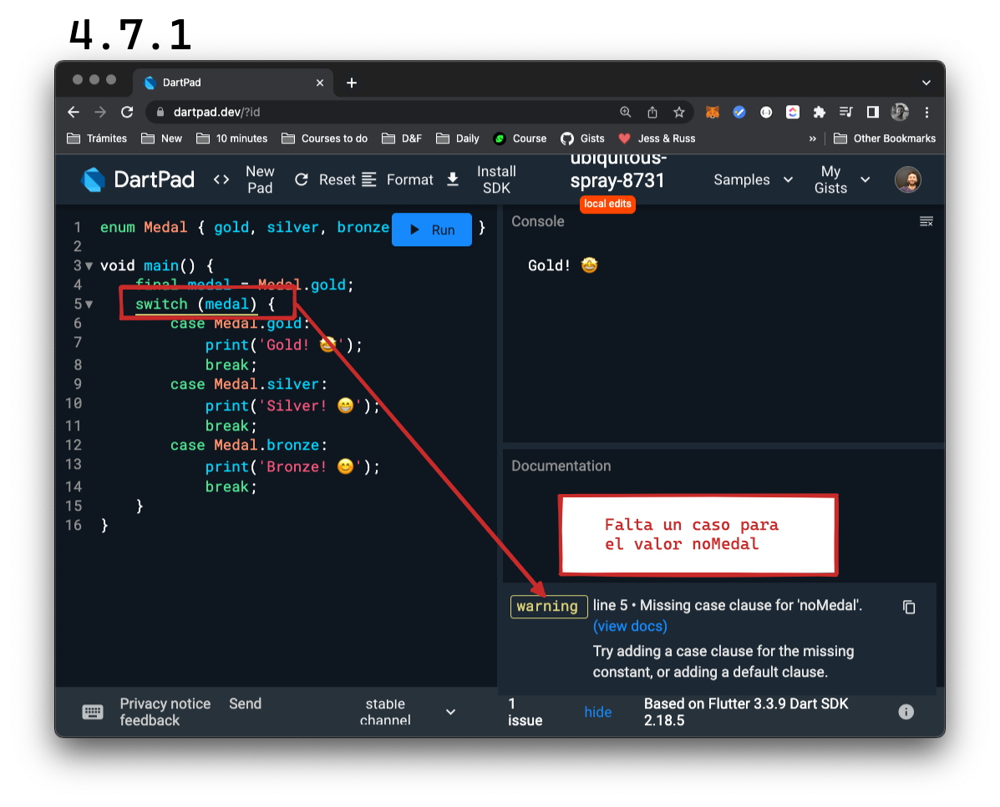

# _Enumerations_

Recordemos el ejemplo anterior de la carrera:

```dart
void main() {
    const pos = 1;
    switch (pos) {
        case 1:
            print('Gold! 🤩');
            break;
        case 2:
            print('Silver! 😁');       
            break;
        case 3:
            print('Bronze! 😊');
            break;
        default:
            print('No medal! Try again! 💪');
            break;
    }
}
```

En este caso, sabemos la cantidad de medallas que tenemos a disposición, por lo que el total de casos es limitado. Qué bueno sería tener alguna __herramienta que nos permita crear un tipo que enumere posibilidades cuando__ estas __son limitadas y pocas__! 😁

Así es! Eso son las _enumerations_! Las creamos de la siguiente manera:

1. Declaramos con `enum`
2. Luego el nombre del _type_ con la primer letra en _uppercase_.
3. Abrimos llaves,
4. Y dentro listamos los valores.

Así: `enum Medal { gold, silver, bronze, noMedal }`

Pero cómo las utilizamos? En conjunto con los `switch` _statements_, son una herramienta super poderosa. Primero creamos el tipo `Medal` fuera de nuestro `main` con los valores posibles, luego declaramos e inicializamos una variable de ese tipo `Medal` con el valor que queramos y luego la utilizamos como variable que vamos a observar. Como los casos son limitados según ese tipo (4, según cada medalla), entonces no nos hace falta un `default` ya que jamás caeríamos allí:

```dart
enum Medal { gold, silver, bronze, noMedal }

void main() {
    final medal = Medal.gold;
    switch (medal) {
        case Medal.gold:
            print('Gold! 🤩');
            break;
        case Medal.silver:
            print('Silver! 😁');       
            break;
        case Medal.bronze:
            print('Bronze! 😊');
            break;
        case Medal.noMedal:
            print('No medal! Try again! 💪');
            break;
    }
}
```

Así, definimos un tipo `Medal` que __tiene mucho significado y todo nuestro código se vuelve más fácil de entender__. Además, podemos __utilizar las ayudas__ que nos provee Dartpad en este caso:



## 💪 Lluvia de enums

__Requirement__: piensen y escriban 5 enums que se les ocurran podrían cumplir con las consignas anteriores. No hace falta escriban ningún `switch`; solamente los `enum`.

__Extra help__: les dejo otro ejemplo: días de la semana.

---

__💀 Solución__:

```dart
enum Suits { hearts, diamons, clubs, spades}
enum Weather { sunny, cloudy, rainy, snowy }
enum OperatingSystems { windows, linux, mac }
enum MeansOfTransport { car, bycicle, motorcycle, plane, boat}
enum MostUsedLanguages { english, spanish, chinese}
```

## _Trailing comma_

Simple! 💀 Quiero prueben escribir estos dos _enum_ exactamente como se los dejo (prestando atención a las comas), clickeen donde dice 'Format' en Dartpad y vean qué sucede:

`enum Weather { sunny, cloudy, rainy, snowy }`
`enum Weather { sunny, cloudy, rainy, snowy, }`

No es necesaria esa coma luego del último valor del `enum` pero es __muy recomendable__ cuando nos facilita la lectura, ya que cuando Dartpad (y luego nuestro editor de código) dé formato a nuestro código, va a __alinear en forma de columna__ en lugar de fila y lo hace mucho más legible en la mayoría de los casos. Y esto no aplica solo a los `enum` sino a __cualquier lista de valores separados por una coma!__

## Un poquito más sobre `enum`

Fíjense qué sucede si intentan imprimir un valor de un `enum`:

```dart
enum Medal { gold, silver, bronze, noMedal }

void main() {
    final medal = Medal.gold;
    print(medal); // Medal.gold
    switch (medal) {
        case Medal.gold:
            print('Gold! 🤩');
            break;
        case Medal.silver:
            print('Silver! 😁');       
            break;
        case Medal.bronze:
            print('Bronze! 😊');
            break;
        case Medal.noMedal:
            print('No medal! Try again! 💪');
            break;
    }
}
```

Y ustedes esperaban que se imprima el nombre! Bueno, para eso (💀), simplemente agreguen un punto al terminar la variable `medal` para llamar a sus métodos y vean qué pasa!

Pueden utilizar el `medal.name` para imprimir el nombre que le asignaron a la variable en lugar de que les imprima por ejemplo, `Medal.gold`.

Además de esto, podríamos ver todos los valores de nuestro `enum` llamándolos de esta manera: `Medal.values` y hasta llamar a uno particularmente, así: `Medal.values.byName('silver'`).

## 💪 Calculadora versión 0.0.1

__Requirement__: escribir una calculadora complementando el código base que les paso, utilizando un _switch statement_ y _assertions_ para chequear que los resultados sean correctos. Tienen que escribir 4 ejemplos, uno para cada operación y los resultados deberían ser: 6, 2, 8 y 2.

__Source code__:

```dart
enum Operation {plus, minus, multiply, divide,}

void main() {
    const a = 4.0;
    const b = 2.0;
    const op = Operation.plus;
    final double result;
    // TODO: implementar debajo el resto
}
```

---

__💀 Solución para result == 6__:

```dart
    enum Operation {plus, minus, multiply, divide,}

void main() {
    const a = 4.0;
    const b = 2.0;
    const op = Operation.plus;
    final double result;
    switch(op) {
        case Operation.plus:
            result = a + b;
            break;
        case Operation.minus:
            result = a - b;
            break;
        case Operation.multiply:
            result = a * b;
            break;
        case Operation.divide:
            result = a / b;
            break;
    }
    assert(result == 6);
    print('Result: $result');
}
```

__💀 Solución para result == 2 ('-')__:

```dart
    enum Operation {plus, minus, multiply, divide,}

void main() {
    const a = 4.0;
    const b = 2.0;
    const op = Operation.minus;
    final double result;
    switch(op) {
        case Operation.plus:
            result = a + b;
            break;
        case Operation.minus:
            result = a - b;
            break;
        case Operation.multiply:
            result = a * b;
            break;
        case Operation.divide:
            result = a / b;
            break;
    }
    assert(result == 2);
    print('Result: $result');
}
```

__💀 Solución para result == 8__:

```dart
    enum Operation {plus, minus, multiply, divide,}

void main() {
    const a = 4.0;
    const b = 2.0;
    const op = Operation.multiply;
    final double result;
    switch(op) {
        case Operation.plus:
            result = a + b;
            break;
        case Operation.minus:
            result = a - b;
            break;
        case Operation.multiply:
            result = a * b;
            break;
        case Operation.divide:
            result = a / b;
            break;
    }
    assert(result == 8);
    print('Result: $result');
}
```

__💀 Solución para result == 2 ('/')__:

```dart
    enum Operation {plus, minus, multiply, divide,}

void main() {
    const a = 4.0;
    const b = 2.0;
    const op = Operation.divide;
    final double result;
    switch(op) {
        case Operation.plus:
            result = a + b;
            break;
        case Operation.minus:
            result = a - b;
            break;
        case Operation.multiply:
            result = a * b;
            break;
        case Operation.divide:
            result = a / b;
            break;
    }
    assert(result == 2);
    print('Result: $result');
}
```
