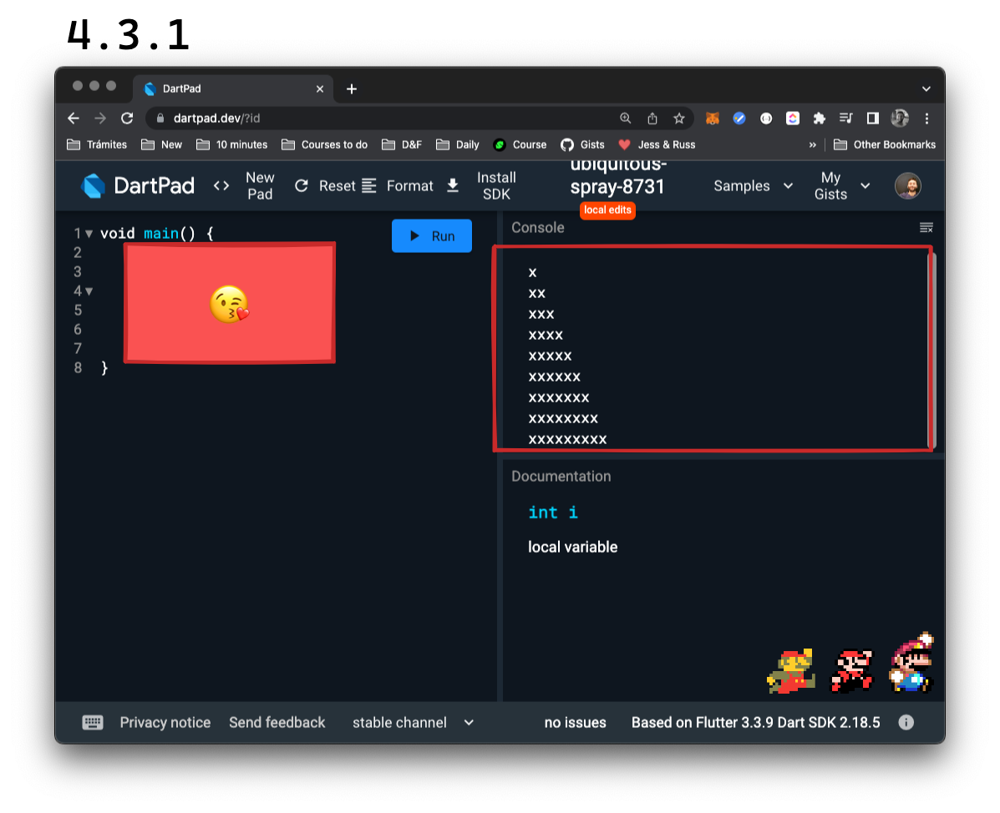
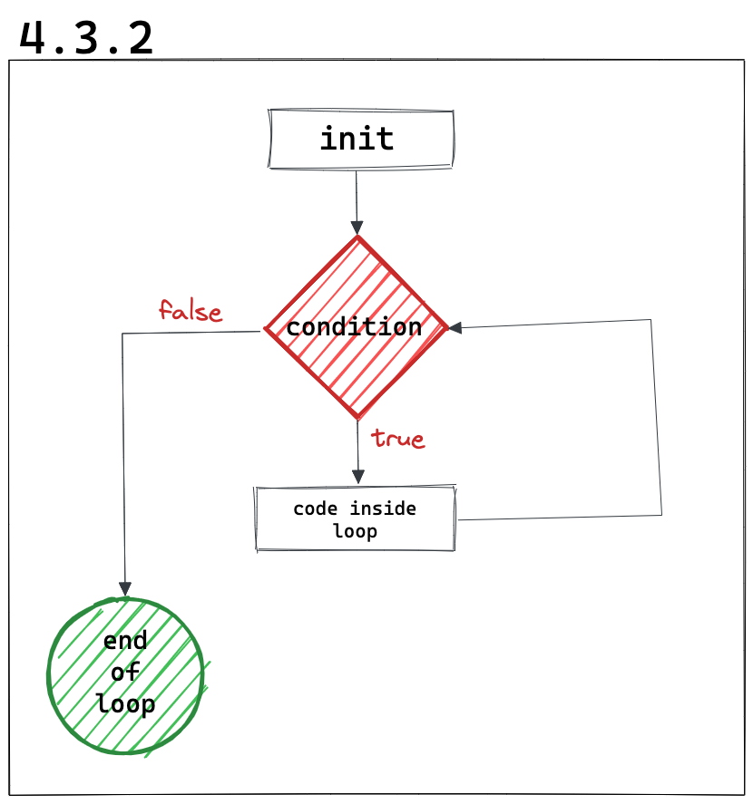

# _While loop_

Un _loop_ es un __bucle, un proceso que se repite de forma infinita__. En el caso de un bucle _while_ (mientras), este se repite siempre que se cumpla una condición que fijamos de antemano.

Por ejemplo supongamos que queremos imprimir una cuenta de 1 a 10 y al final, algo que nos indique que terminamos. Podríamos hacer esto:

```dart
void main() {
    print(1);
    print(2);
    print(3);
    print(4);
    print(5);
    print(6);
    print(7);
    print(8);
    print(9);
    print(10);
    print('Done!');
}
```

Sin embargo, ya vieron que esto no cumple con el principio _DRY, don't repeat your self_ (no se repitan!), se ve bastante horrible y además, nos lleva mucho trabajo. Si utilizamos un _while loop_, se vería así:

```dart
void main() {
    // un int para llevar la cuenta
    int i = 1;
    while(i < 11) {
        print(i);
        i++; // esto se encarga de incrementar
        // la cuenta. Sino, quedaríamos
        // en un loop infinito
        // porque 'i' se mantendría en 1
        // y la condición siempre resultaría
        // en true
    }
    print('Done!');
}
```

Logramos el mismo resultado pero con un poquito más de clase 🧐😵‍💫🤣.

## 💪 Mario world

__Requirement__: Imprimir la siguiente figura:



__Clue__ (pista): pueden concatenar una `String` la cantidad de veces (N) que quieran (_String multiplication_) así: 'string' * N.

---

__💀 Solución__:

```dart
void main() {
    const block = 'x';
    var i = 1; 
    while(i < 10) {
        print(block*i);
        i++;
    }
}
```

Si quisiéramos hacer un diagrama de los _while loop_ se vería así:


