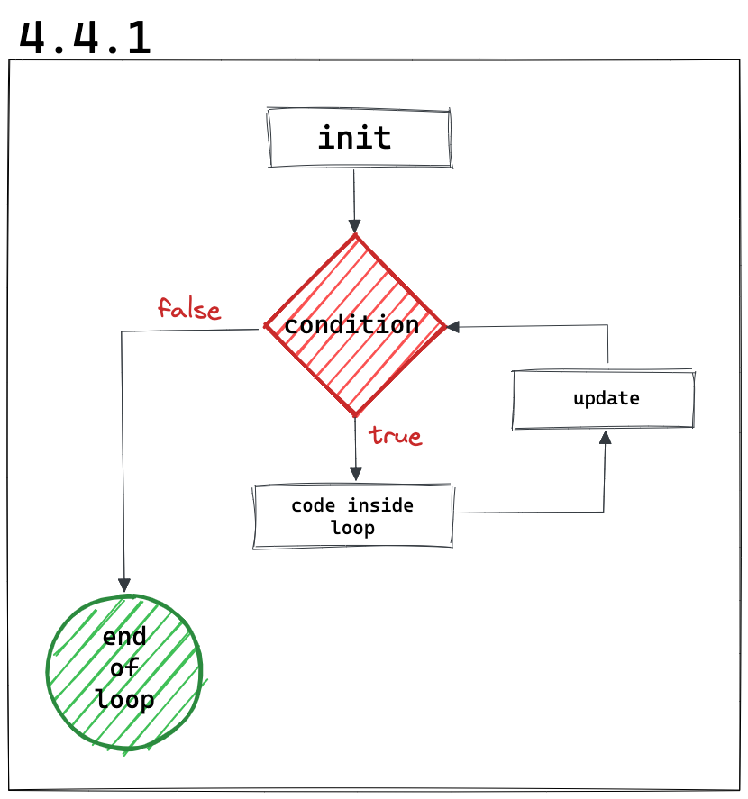

# _For loop_

Este tipo de bucle sirve para lograr lo mismo que el _while loop_ pero de forma más concisa.

Veamos cómo sería la solución del ejercicio anterior pero implementado con un _for loop_:

```dart
void main() {
    const block = 'x';
    for(var i = 1; i < 10; i++) {
        print(block*i);
    }
    print('Done');
}
```

Fíjense que de esta forma, nos lleva un par de líneas menos aun! Pero cómo funciona?

1. Declaramos e inicializamos la variable: `var i = 1;`.
2. Establecemos la condición que se tiene que cumplir para salir del bucle: `i < 10;`.
3. Definimos cuál será el incrementador: `i++`.

Así, lo que está dentro del bucle (dentro de las `{...aquí...}`) se ejecutará hasta que la condición que hayamos establecido, resulte en `true`.

Tendríamos de esta manera un diagrama parecido al anterior solo que en este caso nuestro _for loop_ pide de forma explicita la actualización (incrementación en este caso) de la variable inicializada:


