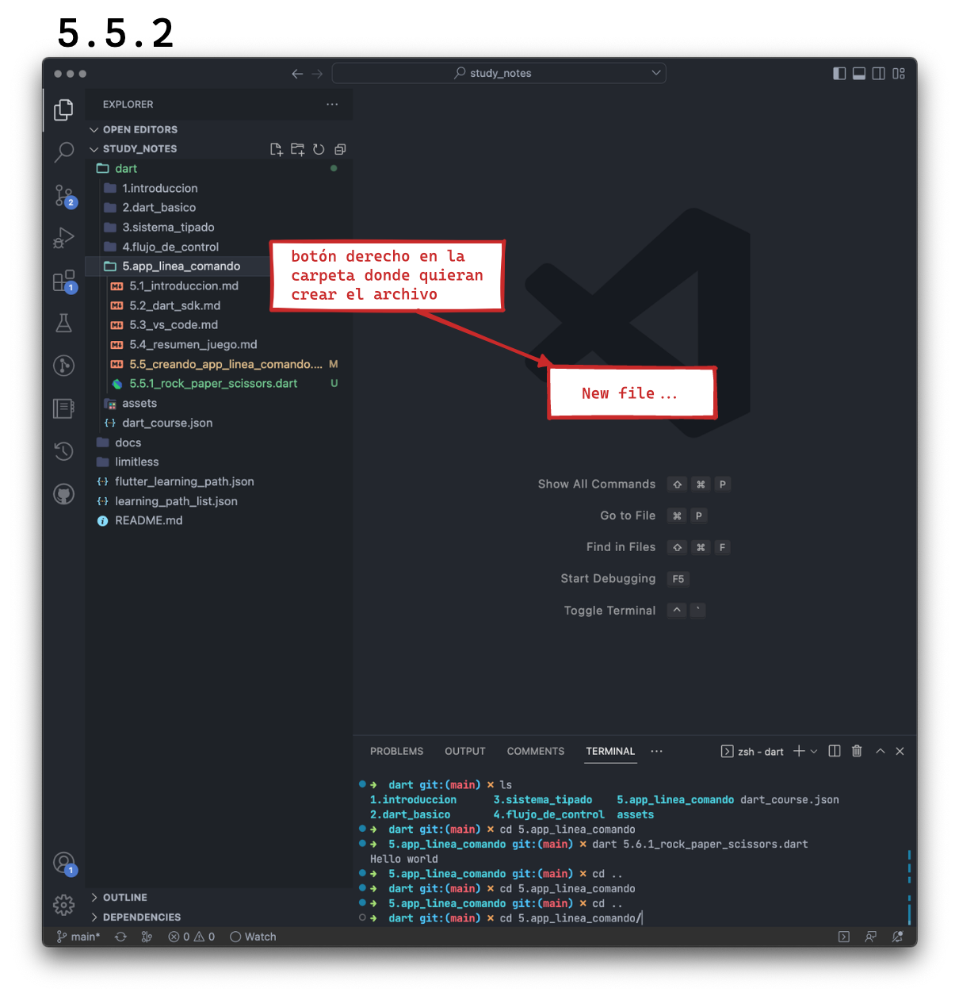
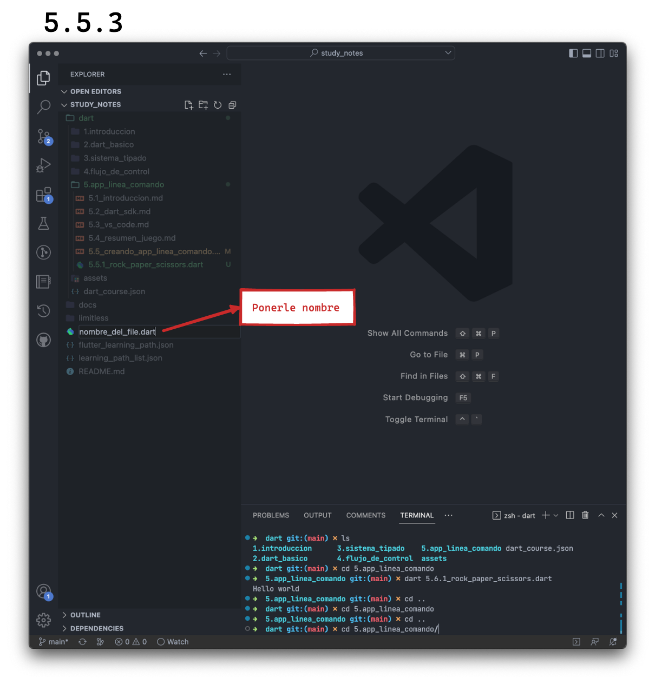

# Creando una app en línea de comando

Lo primero que tenemos que hacer es inicializar la terminal y allí crear un directorio donde van a alojar todas sus prácticas. Aquí vamos a estar creando los ejercicios dentro de la carpeta de cada sección.

Para crear una carpeta en la terminal, escribimos `mkdir`, un espacio y el nombre de la carpeta. Por ejemplo `mkdir dart_exercises`.

Para ingresar en dicha carpeta utilizan el comando `cd`, un espacio y el nombre de la carpeta. Pueden empezar escribiendo el primer caracter de dicha carpeta y luego la tecla _tab_ que les va a completar el nombre si es que hubiera una sola carpeta con un nombre que comience en dicho caracter. Sino, pueden seguir escribiendo hasta dar con la coincidencia y finalmente _enter_ para ingresar. Sería aquí: `cd 5.app_linea_comando`.

Allí, ingresamos `code .` y eso nos debería abrir una nueva instancia/ventana de VS Code. Si esto no sucede, puede ser que no tengan agregado VS Code a su path. Para ello:

1. Abran una instancia de VS Code como la harían regularmente.
2. Allí escriban `shift - cmd/ctrl - p` y escriban allí 'shell command' y seleccionen la opción que dice 'Install code command in PATH'.

A partir de ahora, van a poder abrir VS Code escribiendo `code` desde su terminal. En nuestro caso, como queremos abrir una instancia de VS Code desde el directorio en el que estábamos parados, escribimos luego de `code` y espacio, el `.`, que refiere al directorio en el que estamos.

Una vez allí, vamos a crear nuestro primer archivo o _file_:

