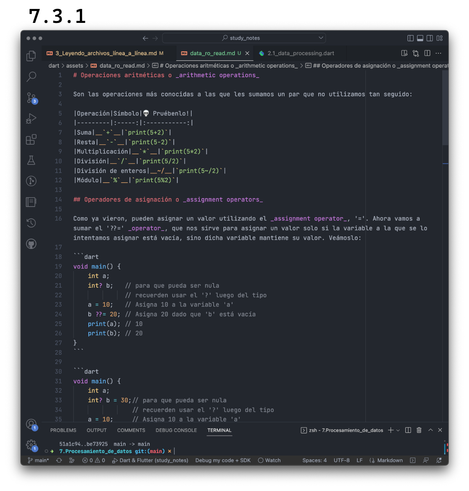

# Leyendo archivos línea a línea

Para este ejercicio, vamos a utilizar uno de nuestros artículos de la siguiente manera:

1. Ir a [este link]().
2. Hacer click en donde dice _'raw'_.
3. Copiar todo el contenido.
4. Crear un archivo nuevo en el directorio en el que se encuentran trabajando, con nombre data_to_read.md
5. Pegar el contenido en dicho archivo.

Deberían ver algo como lo siguiente: 
