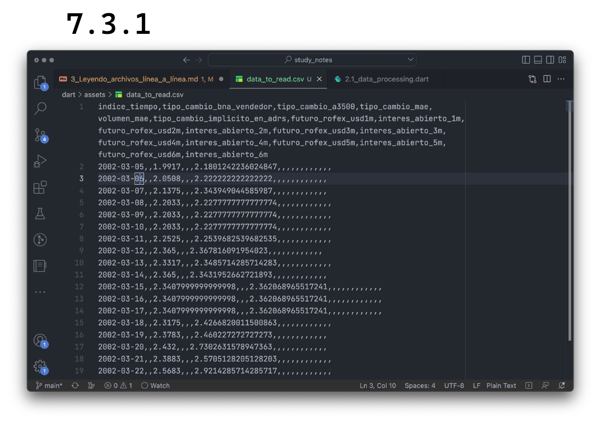
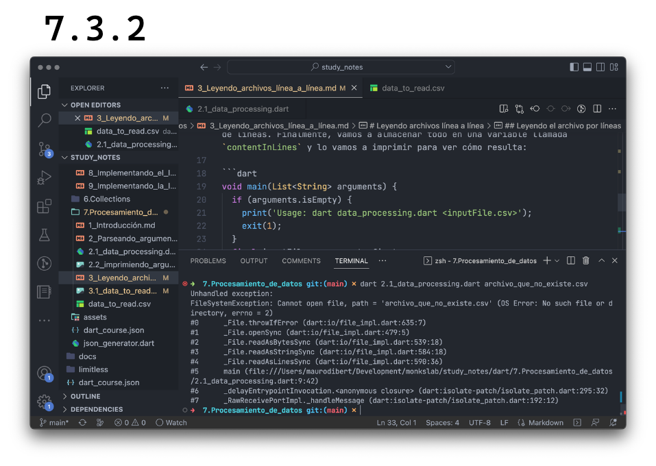
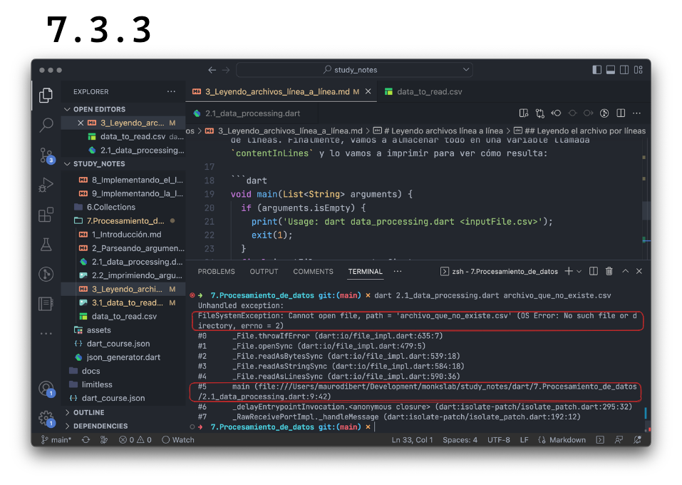

# Leyendo archivos línea a línea

Para este ejercicio, vamos a utilizar un archivo que muestra todas las películas de Robert DeNiro, con el año de cada película, el título y rating.

1. Ir a [este link](https://github.com/themonkslab/courses/blob/main/dart/7.Procesamiento_de_datos/data_to_read.csv). Allí podrán ver un _preview_ o vista previa del archivo, cómo se vería tabulado.
2. Hacer click donde dice _raw_ o crudo.
3. Copiar todo el contenido.
4. Crear un archivo nuevo en el directorio en el que se encuentran trabajando, con nombre data_to_read.csv
5. Pegar el contenido en dicho archivo.
6. Guardarlo.

Deberían ver algo como lo siguiente: .

## Leyendo el archivo por líneas

Ahora que ya tenemos nuestro archivo guardado, vamos a tratar de leer su contenido. Para ello crearemos una referencia a nuestro archivo con la clase `File` pasándole como argumento el archivo que introdujimos para leerlo línea por línea con el comando `readAsLinesSync`, que nos va a devolver una lista de líneas. Finalmente, vamos a almacenar todo en una variable llamada `contentInLines` y lo vamos a imprimir para ver cómo resulta:

```dart
void main(List<String> arguments) {
  if (arguments.isEmpty) {
    print('Usage: dart data_processing.dart <inputFile.csv>');
    exit(1);
  }
  final inputFile = arguments.first;
  final contentInLines = File(inputFile).readAsLinesSync();
  for (var line in contentInLines) {
    print(line);
  }
}
```

Qué buena onda! Ya podemos leer un archivo que le pasemos a nuestro programa y todo por línea de comandos! Díganme si no se sienten Neo en la primer Matrix! 😄

En este caso, sabemos que vamos a subir un archivo que tengamos, sabemos su nombre, etc. 💀 __Qué sucedería sin embargo, si introducimos el nombre de un archivo que no existe?__  Ya saben qué hacer! Vayan a probar y romper! 🤣



Esos errores, al principio, pueden darnos mucho miedo! 🧟‍♂️ Pero si lo tomamos con calma y tratamos de entenderlo línea por línea, la cosa cambia, ya que si bien no vamos a entender siempre cada línea, nos basta con aquellas que nos dirijan a la solución de nuestro error. Ah! __Importante: siempre empezar leyendo errores desde la primera línea, de arriba hacia abajo y de izquierda a derecha__:



Aquí podemos ver el _stack trace_ de nuestro error o la __pila de procesos__, uno arriba del otro, __desde la última manifestación del fallo hasta el proceso que lo provocó__.

Primero tenemos un `FileSystemException` o excepción del sistema. Luego nos dice que no puede abrir el archivo y nos da el _path_ o ubicación del archivo. Y finalmente nos dice que ese archivo o directorio no se encuentra. 😄 Ya esto debiera ser suficiente para entender por qué falló!

Sin embargo, en el paso #5, luego nos dice en qué archivo se produjo el fallo, incluyendo línea (9) y columna (42). Si ustedes hacen `cmd/ctrl + click` sobre ese archivo, los va a dirigir exactamente al lugar donde se produjo el error. Muy útil no?

Sería correcto escribir nuestro código defensivo, esperando que pueda suceder un error, sin embargo nos falta conocimiento de futuros y código asíncrono, así que lo haremos en... el futuro! 😂
