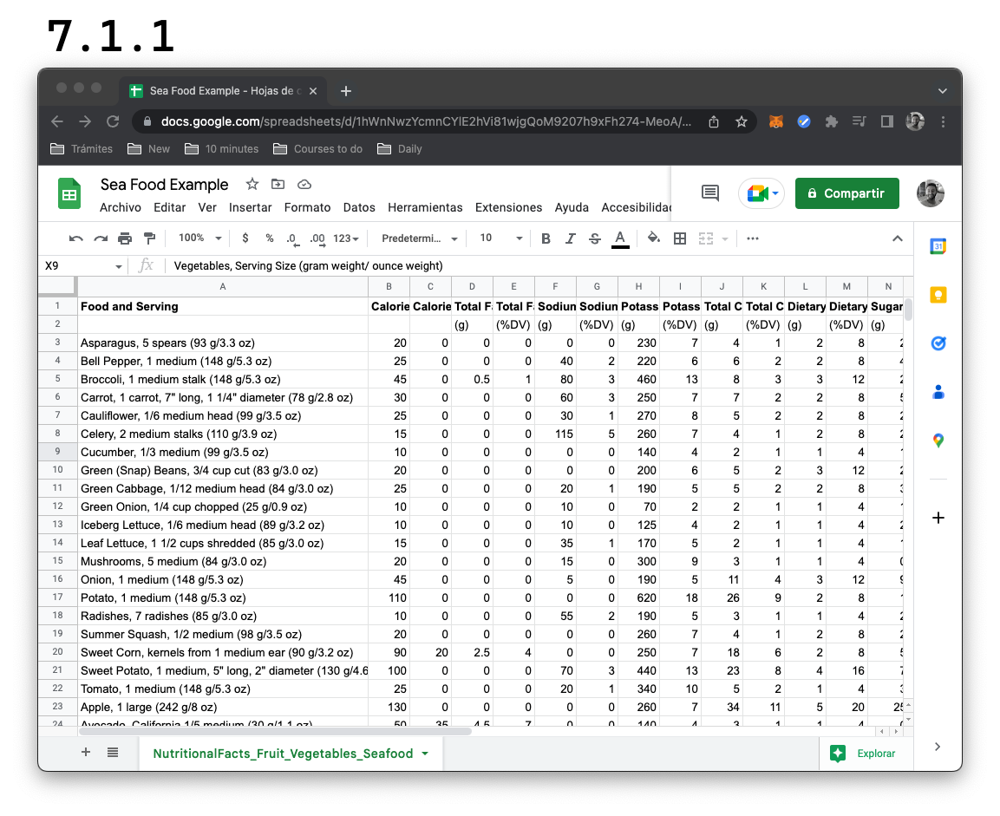

# Introducción

En esta sección vamos a utilizar Dart para procesar datos provenientes de un archivo `.csv`, que vendría a ser un archivo de texto separado por comas y lo pueden hacer con cualquier hoja de cálculo que ya tengan hecha.

Una vez en su app preferida de hojas de cálculo, van a descargar y les aparecerán varias opciones; elijan la que les permite exportarlo como `.csv` y tendrán su archivo separado por comas listo para utilizar!

En nuestro caso, utilizaremos la que les dejo dentro de los assets, aquí: [ejemplo para procesar datos](../assets/NutritionalFacts_Fruit_Vegetables_Seafood.csv).

Este `csv` es una planilla con alimentos posibles de conseguir estando cerca del mar 🙃 y se puede ver así:

La vamos a utilizar para identificar cuáles de ellos tienen más calorías, grasas y otros nutrientes, cosa que seguramente no nos sea de demasiada utilidad ahora pero nos va a servir para aprender a procesar cualquier tipo de dato que nos interese! Vamos a ello! 🥳
