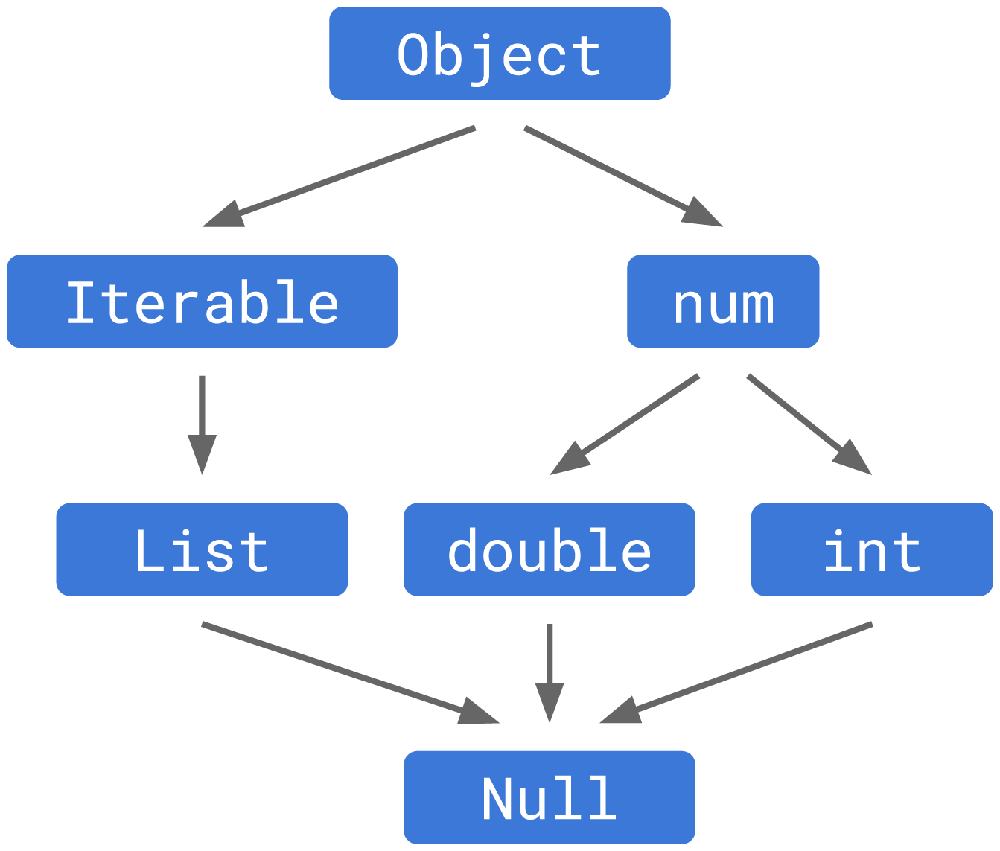
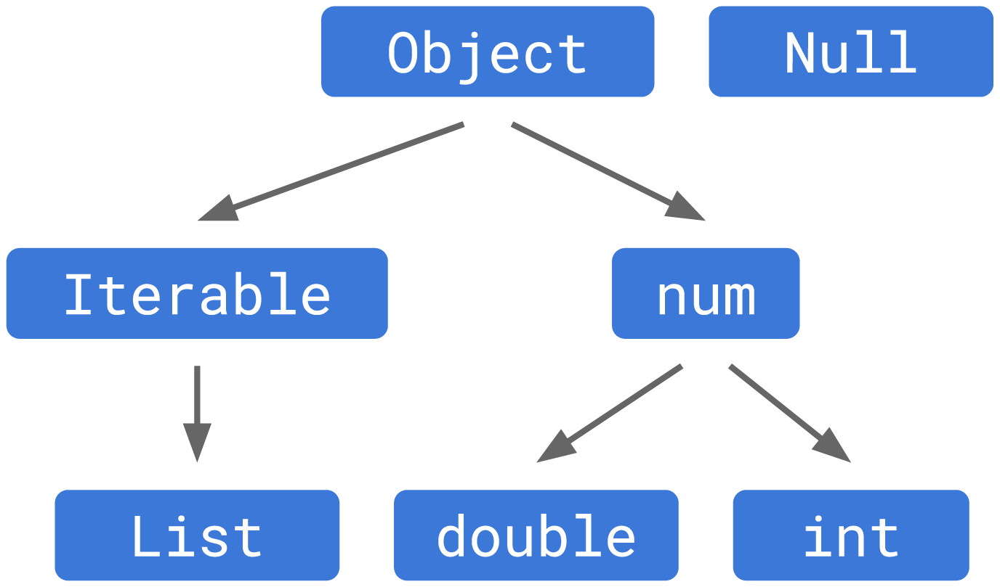

# Jerarquías

Voy a tratar de contárselos de forma simple porque aun hay cosas que no vimos; espero que leyendo tranquilamente se pueda entender. Sino, siempre tienen la posibilidad de sumarse a [nuestro Discord]() y allí preguntar hasta entender! 🤓

El gráfico proveniente de la [documentación sobre null safety en Dart](https://dart.dev/null-safety/understanding-null-safety), muestra cómo era la jerarquía de tipos antes de que se incluyera _null safety_:



Aquí podemos observar una simplificación donde todos los tipos eran hijos del tipo `Object` (aun no vieron `Iterable` y `num` pero básicamente son a su vez, padres de `List` y `double` e `int` como se ve en el gráfico). Debajo de todo, se encontraba el tipo `Null`.

Pero qué significa que son padres e hijos? Ya veremos herencia pero simplemente __los hijos tienen la posibilidad de hacer lo que hace su padre__.

Supongamos que nos encontramos a Superman con su hijo y a Batman con el suyo: el hijo de Superman hereda la posibilidad de volar, tirar rayos con los ojos y su marcada reticencia a la kryptonita. Mientras que el hijo de Batman solo hereda fortunas! 🤣

__La serie de operaciones que se permiten en algunas expresiones son definidas por su tipo.__ Repito porque esto es muy importante: La serie de operaciones que se permiten en algunas expresiones son definidas por su tipo. Si el tipo es una `List`, podemos llamar a `.add()` como ya lo vimos o si es `int` podemos utilizar el `+` pero el valor nulo, no tiene ninguno de esos métodos aunque porqué podemos imprimirlo? Porque de los únicos tres métodos con los que cuenta, uno es el `toString()`, que le permite mostrarse como si fuera una cadena de texto.

Si permitiéramos que el valor nulo se mueva por otros tipos que no es el suyo, va a fallar. Y esta es __la clave de todo _null safety_: cada fallo proviene de tratar de acceder a un método o propiedad que `null` no contiene.__

Cómo arregló esto _null safety_? Cambiando la jerarquía.

## Nueva jerarquía desde _null safety_

__Ahora el `Null` _type_ existe pero ya no es un hijo de todos los tipos anteriores.__



Y ya que no es más un hijo o subtipo, la clase `Null` permite un valor `null` y __el resto de los tipos son no nulleables por defecto,__ explicando lo que ya vimos anteriormente.

Así, un valor puede fluir de ser nulo a no nulo según el _static check_ o nosotros de forma explícita, lo definamos. De esta manera, nos aseguramos para siempre y nunca jamás, tener errores por valores nulos! 😅 Bueno, no es del todo cierto ya que los tendremos pero por lo menos habremos tenido de nuestro querido Dart, toda la ayuda necesaria para que esto haya podido ser evitado! 😂

## El problema anterior

Recuerdan el ejercicio? Por qué imprime el valor nulo? Y porqué se puede utilizar el método `toUpperCase()` en una `String?`?

```dart
void main() {
  const hardware = <String?>['Mouse', 'Keyboard', null];
  for (var hardwarePiece in hardware) {
    print(hardwarePiece?.toUpperCase());
  }
}
```

Aquí ya respondimos la mitad en los párrafos anteriores: imprime el valor nulo porque este sí tiene dentro de sus únicos tres métodos, uno llamado `toString()` que nos permite pasar a cadena de texto su valor y por ende imprimirlo.

Por el otro, nos permite acceder al método `toUpperCase()`? La gente de Dart hizo que el tipo nulleable, en este caso el `String?`, sea padre de los tipos `String` y `Null` de forma tal que pueda recibir ambas formas. En nuestro ejemplo, el _static check_ sabe que el valor es una `String` y eso es lo que recibe el padre pudiendo aplicar sus métodos, en este caso el `toUpperCase()`.

De esta forma, la jerarquía quedaría algo así, teniendo debajo de todo, una clase `Never` que no veremos por ahora y permite detener la ejecución de la aplicación y lanzar una excepción.


